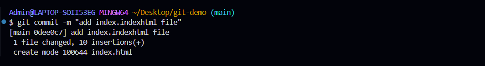

# Báo cáo tuần 1: Git

## Phần 1: Giới thiệu tổng quát về Git
- Git là một hệ thống quản lý phiên bản (Version Control System - VCS) phổ biến được sử dụng để theo dõi các thay đổi trong source code trong quá trình phát triển phần mềm
- Git được phát triển bởi **Linus Torvalds** vào năm 2005 và nhanh chóng trở thành một công cụ quan trọng cho developer
- Git được tạo ra nhằm mục tiêu:
    - Tốc độ cao
    - Phân tán
    - An toàn
    - Hỗ trợ branching hiệu quả
- Khác biệt giữa Git và GitHub/GitLab/Bitbucket:
    - Git: Là công cụ quản lý phiên bản. Nó chạy trực tiếp trên máy tính để theo dõi lịch sử thay đổi mã nguồn, giúp tạo nhánh, gộp code, ...
    - GitHub / GitLab / Bitbucket: Là nền tảng lưu trữ và cộng tác trực tuyến dành cho các repository Git. Chúng chạy trên web và giúp bạn chia sẻ, quản lý nhóm, issue, CI/CD ... 
- Cài đặt Git & cấu hình ban đầu:
    - Cấu hình thông tin người dùng
        - `git config --global user.name "Phamthang"`
        - `git config --global user.email "gm.gmphamthang@gmail.com"`
    - Thiết lập SSH key:
        - Tạo SSH key mới (chuẩn Ed25519): `ssh-keygen -t ed25519 -C "gm.phamthangg@gmail.com"`
        
        
        
        - Khởi động SSH agent ở chế độ nền: mở power shell quyền admin
            - `Get-Service -Name ssh-agent | Set-Service -StartupType Manual`
            - `Start-Service ssh-agent`
        - Add private key vào: `ssh-add "C:\Users\Admin\.ssh\id_ed25519"`
        - Add public key lên github
        
        

## Phần 2: Làm việc với repository

### 2.1. Một số lý thuyết cơ bản
- Lệnh `git init`: Khởi tạo repo mới trên máy local
    - Tạo một thư mục `.git` trong project, chứa lịch sử và metadata
    - Biến thư mục hiện tại thành một Git repository
- Lệnh `git clone`: Tạo bản sao đầy đủ của remote repo về local
- Cấu trúc thư mục `.git`:
    - **HEAD**: con trỏ chỉ nhánh hiện tại
    - **objects/**: nơi lưu commit, file, tree dưới dạng hash
    - **refs/**: chứa nhánh và tag
    - **config**: cấu hình riêng của repo
- Trạng thái của file trong Git:
    - **untracked**: File chưa được Git quản lý
    - **modified**: File đã thay đổi nhưng chưa đưa vào staging
    - **taged**: Đã chọn để đưa vào commit
    - **committed**: Thay đổi đã được lưu vào lịch sử
- Lệnh `git status`: Kiểm tra trạng thái
    - Biết file nào đang thay đổi
    - Trạng thái từng file
- Lệnh `git diff`: Kiểm tra sự khác bit nội dung
    - Hiển thị thay đổi trong working directory so với phiên bản đã commit
    - Rất quan trọng khi review trước khi commit
- Lệnh `git add`: thêm file vào staging
    - Sau khi add trạng thái file sẽ là: staged
- Lệnh `git commit`: Lưu trạng thái staged vào lịch sử với một message mô tả rõ ràng
- Quy tắc viết commit message tốt:
    - Viết ngắn gọn mô tả hành động cụ thể
    - Dạng mệnh lệnh: Add, Update, Fix, Remove, ...

### 2.2. Thực hành: làm việc với repo
- Clone repo đã tạo sẵn trên github về, dùng lệnh `git clone`
    
- Tạo file index.html và xem trạng thái với lệnh `git status`, sẽ thấy nó là **untracked**
    
- Đưa file vào stagong với lệnh `git add`, Kiểm tra lại trạng thái sẽ thấy nó là **staged**
    
- Commit thay đổi với lệnh `git commit`
    
- Tiếp tục sửa file index.html và sửa file README.md, sau đó xem trạng thái file và xem sự thay đổi nội dung
    
    
- add và bổ sung commit thứ hai
- Kiểm tra lịch sử với `git log`
    
- push code lên remote repo

## Phần 3: Làm việc với lịch sử và phiên bản

### 3.1. Một số lý thuyết cơ bản
- Lệnh `git log`: hiển thị toàn bộ lịch sử commit, gồm: Commit ID (SHA-1), Tác giả, Thời gian, Commit message
- Lệnh `git show`: hiển thị nội dung thay đổi chi tiết của một commit
- Lệnh `git blame`: Cho biết mỗi dòng trong file được commit từ commit nào
- Undo file trước khi add dùng `git restore`: Trả file về phiên bản commit gần nhất
- Undo file đã add vào staging dùng `git restore --staged`: file rời khỏi staging, nội dung vẫn giữ nguyên
- Lệnh `git reset`: xóa toàn bộ thay đổi và quay lại commit gần nhất
    - `git reset --hard commit_id` :di chuyển branch về commit chỉ định và vứt bỏ toàn bộ thay đổi sau commit đó
    - `git reset --soft commit_id` : di chuyển branch về commit chỉ định và keep các file đã được thay đổi thành staged
- Khi đã push commit sai lên remote repo, dùng `git revert`: Tạo commit mới để đảo ngược thay đổi, lịch sử vẫn an toàn, không mất commit đã làm
- Khi nào nên dùng revert thay vì reset?
    - Commit chưa push => dùng reset
    - Commit đã push và team đang làm chung => dùng revert
- Làm việc với `.gitignore`:
    - Chỉ định những file Git không theo dõi, thường là: File build, File cấu hình cá nhân, Thư viện bên thứ ba, File chứa secrets
    - Thông thường sẽ chặn những file như: node_modules/, build/, .env, *.log

### 3.2. Thực hành: làm việc với lịch sử và phiên bản
- Giả sử có push code lỗi lên repo
    
- dùng `git blame` và `git show` để tìm xem ai push code lỗi và xem nội dung bị sửa sai
    
- Sửa lỗi và undo, trong case này code đã push lên remote repo nên sẽ dùng `git revert`: tạo commit mới đảo ngược commit cũ
    
- Thiết lập `.gitignore` và test thử
    - Tạo file `.gitignore`
    - Thêm nội dung:
        ```bash 
        node_modules/
        dist/
        .env
        .idea/
        .vscode/
        *.log
        ```
    

## Phần 4: Nhánh (Branching) & hợp nhất (Merging)

### 4.1. Một số lý thuyết cơ bản
- Branch là gì và tại sao cần branch?
    - Branch trong Git là một dòng phát triển độc lập trong cùng repository
    - Nó cho phép nhiều người cùng làm việc trên các tính năng khác nhau mà không ảnh hưởng đến mã nguồn ổn định trên main
- Lợi ích chính:
    - Tách biệt môi trường phát triển và môi trường ổn định
    - Dễ quản lý code theo chức năng
    - Kiểm soát review code trước khi merge vào main
    - Giảm rủi ro gây lỗi cho môi trường chạy thật
- Lệnh `git branch`: liệt kê và tạo nhánh
- Lệnh `git checkout <branch>`: chuyển sang nhánh khác
- Lệnh `git checkout -b <branch>`: tạo và chuyển sang nhánh mới ngay
- Lệnh `git switch <branch>`: dùng để chuyển nhánh
- Lệnh `git merge <branch>`: dùng để hợp nhất nhánh
- Chiến lược branching phổ biến:
    - **GitHub Flow**: đơn giản, phù hợp team nhỏ
        - main chạy production
        - Mỗi chức năng sinh nhánh feature/* từ main
        - Khi xong: Pull request vào main 
    
    

    - **Git Flow**: phổ biến với dự án phức tạp, có release rõ ràng
        - main: production
        - develop: nhánh tích hợp code chuẩn bị release
        - feature/*	: phát triển chức năng
        - release/*	: chuẩn bị ra phiên bản
        - hotfix/* : sửa lỗi gấp trên production
    
    

### 4.2. Thực hành làm việc với nhánh và hợp nhất
- Tạo nhánh mới để phát triển
    - Tạo nhánh develop từ nhánh main
    - Tạo thêm 1 vài file
    - push nhánh develop lên repo github
    
    
    - pull request từ nhánh develop vào main
    
- Giả lập trường hợp DevA và DevB cùng sửa 1 file. Nhưng DevB pull request trước, sau đó DevA mới pull request và bị conflict
    - Tạo 2 thư mục DevA và DevB, clone repo về 2 thư mục này
    - tạo 2 nhánh và cùng sửa 1 file trên đó
    - DevB sẽ push lên và pull request trước -> không bị conflict
    
    
    - Sau đó DevA sẽ push lên và pull request -> bị conflict
    
    
- Xứ lý conflict: có thể xử lý trên GUI hoặc pull về local để xử lý rồi merge lại
    - 2 ông dev phải thảo luận với nhau để chốt phuong án đúng
    
    - sau đó ấn commit merge, nó sẽ tạo ra thêm 1 commit 
    

## Phần 5: Remote repository

### 5.1. Một số lý thuyết cơ bản
- Remote repository là version Git lưu trên server GitHub/GitLab/Bitbucket
- Lệnh `git push -u origin main`: push code từ local lên github
    - `-u`: gắn nhánh local với remote branch
    - Từ sau chỉ cần `git push` là đủ
- `git pull`: Lấy code mới từ remote và merge luôn
- `git fetch`: Chỉ tải cập nhật về nhưng không merge
- Workflow làm việc nhóm:
    - Dev fork repository của Lead
    - Dev clone về máy
    - Dev tạo branch: feature/*
    - Dev commit code
    - Dev push lên repo cá nhân
    - Dev tạo Pull Request gửi Lead review
    - Lead review + merge + delete branch

### 5.2. Thực hành
- Coi như cách thức nộp bài ạ!

## Phần 6: Công cụ và kỹ năng nâng cao

- Tag và versioning:
    - Đánh dấu các phiên bản quan trọng để release sản phẩm
    - Lệnh `git tag <tag_name> <branch_name>`: đánh tag cho nhánh
    - xem danh sách tag: `git tag`
    - `git push origin --tags`
- Git stash: 
    - `git stash`: lưu tạm thời thay đổi chưa commit
    - `git stash pop`: lấy lại những thay đổi đó để tiếp tục làm việc
    - `git stash list`: xem danh sách các stash
- Rebase và squash
    - Sắp xếp lại lịch sử commit để gọn đẹp hơn trước khi merge vào main
    - Quy tắc:
        - Rebase để dọn lịch sử trước khi tạo Pull Request
        - Không rebase nhánh đã được công khai và người khác đang dùng
- Git alias:
    - Rút ngắn lệnh dài, tăng tốc khi làm việc thường xuyên
    - alias phổ biến:
        - `git config --global alias.st status`
        - `git config --global alias.cm commit`
        - `git config --global alias.br branch`
- Git reflog:
    - Khôi phục commit tưởng như đã mất khi reset nhầm hoặc merge sai
    - Reflog hiển thị mọi điểm dịch chuyển HEAD

## Phần 7: Thực hành thực tế
- Trường hợp revert code và merge conflict đã xử lý ở các phần thực hành trên
- Trường hợp rollback phiên bản
    - Đánh tag cho main, coi như phiên bản v1.0 đã ổn định
        - `git tag v1.0 main`
        - `git push origin --tags`
    - Phát triển phiên bản mới
        - chuyển sang nhánh develop
        - chuyển tạo nhánh feature/payment từ develop
        - thêm file
        - push lên repo và pull request vào nhánh main
        - Đánh tag v1.1
        
    - Phát sinh lỗi sau khi release v1.1, Rollback về v1.0
        - Người dùng báo lại phiên bản này bị lỗi
        - Kiểm tra lịch sử trước khi rollback
        
        - Sau khi rollback về v1.0
        

- Khi nào thì cần thực hiện việc fetch, pull?
    - `git fetch`: Sử dụng khi muốn đồng bộ thông tin về trạng thái các nhánh trên remote nhưng chưa muốn ảnh hưởng tới code đang làm dở trên nhánh hiện tại
        - Trước khi bắt đầu phát triển task mới, cần kiểm tra xem có nhánh nào của người khác đã thay đổi hay không
        - Khi muốn xem remote branch có commit mới hay không mà chưa muốn merge
        - Trong quy trình review code hoặc theo dõi tiến độ của nhóm
    - `git pull`: Sử dụng khi cần lấy code mới nhất từ remote về và hợp nhất ngay vào nhánh hiện tại để tiếp tục phát triển
        - Trước khi bắt đầu commit mới, bảo đảm đang dựa trên code mới nhất
        - Trước khi tạo Pull Request hoặc push code lên server
        - Khi Lead yêu cầu cập nhật hotfix khẩn cấp từ remote vào local

