# Báo cáo tuần 2: Linux

## Phần 1: Giới thiệu tổng quan về Linux
- Khái niệm OS Opensource:
    - Mã nguồn của hệ điều hành được công khai để bất kỳ ai cũng có thể xem, sửa đổi và phân phối lại
    - Đặc điểm chính:
        - Tự do sử dụng cho mọi mục đích (cá nhân hoặc thương mại)
        - Tự do chỉnh sửa mã nguồn để phù hợp nhu cầu
        - Tự do phân phối lại phiên bản đã chỉnh sửa
- Lịch sử phát triển:
    - Phát hành năm 1991 bởi **Linus Torvalds** và trở thành Opensource vào năm 1992
    - **Linus** đăng mã nguồn đầu tiên của Linux kernel (nhân hệ điều hành) lên Internet và mời cộng đồng cùng đóng góp
    - Sau đó, nhiều tổ chức và cá nhân tham gia phát triển, khiến Linux ngày càng hoàn thiện
- **Linux Kernel** là “trái tim” của hệ điều hành, chịu trách nhiệm quản lý tài nguyên phần cứng như CPU, RAM, ổ cứng, thiết bị ngoại vi
- Một số bản phân phối phổ biến:

| Tên | Đặc điểm | Đối tượng sử dụng |
|-----|----------|-------------------|
| Ubuntu | Dễ dùng, giao diện đẹp, hỗ trợ tốt | Người mới bắt đầu, lập trình viên |
| CentOS/RHEL | Ổn định, dùng trong doanh nghiệp | Server, DevOps |
| Debian | Bảo mật, độ ổn định cao | Máy chủ, nghiên cứu |
| Kali Linux | Dành cho bảo mật, pentest | Chuyên gia an ninh mạng |
| Arch Linux | Linh hoạt, tự cấu hình | Người dùng nâng cao |

- Linux được sử dụng trong hầu hết các lĩnh vực:
    - **Server & Cloud**: Hầu hết máy chủ web và dịch vụ đám mây đều chạy Linux
    - **DevOps**: Các công cụ như Docker, Kubernetes, Jenkins hoạt động chủ yếu trên nền Linux
    - **AI/ML & Data Science**: Các framework như TensorFlow, PyTorch chạy tốt nhất trên Linux
    - **Lập trình hệ thống & nhúng**: Linux được dùng trong các thiết bị IoT, router, robot, ô tô thông minh
- So sánh Linux với Windows/macOS:

| Tiêu chí | Linux | Windows | macOS |
|----------|-------|---------|-------|
| Bản quyền	| Miễn phí, mã nguồn mở | Trả phí | Trả phí |
| Tùy biến | Rất cao | Thấp | Thấp |
| Bảo mật | Cao, ít virus | Dễ bị tấn công | Cao |
| Hiệu năng | Nhẹ, ổn định | Nặng | Tốt |
| Môi trường dev | Ưu tiên | Phổ biến | Hạn chế |

- Ưu điểm nổi bật của Linux:
    - **Miễn phí và mã nguồn mở**: Không tốn phí bản quyền, có thể tùy chỉnh sâu
    - **Bảo mật cao**: Do cấu trúc quyền hạn và cộng đồng cập nhật nhanh chóng
    - **Hiệu suất ổn định**: Ít tốn tài nguyên, phù hợp cho máy chủ
    - **Cộng đồng lớn**: Nhiều tài liệu, diễn đàn, hỗ trợ mạnh
    - **Khả năng tùy biến**: Có thể tạo ra bản Linux riêng
- Kiến trúc hệ thống linux
    - **Kernel** (Nhân hệ điều hành)
        - Là phần lõi của hệ thống, giao tiếp trực tiếp với phần cứng
        - Quản lý CPU, bộ nhớ, tiến trình, thiết bị và hệ thống file
    - **Shell** (Trình thông dịch lệnh)
        - Là lớp trung gian giữa người dùng và kernel
        - Cho phép người dùng nhập lệnh để thực hiện các tác vụ
    - **Application Layer** (Tầng ứng dụng)
        - Bao gồm các chương trình, công cụ, dịch vụ mà người dùng tương tác
- Quá trình khởi động cơ bản (Boot Process), gồm 5 bước chính:
    - **BIOS/UEFI**: Kiểm tra phần cứng và tải bootloader
    - **Bootloader (GRUB)**: Chọn và nạp kernel vào bộ nhớ
    - **Kernel Initialization**: Khởi tạo thiết bị, tiến trình gốc (init hoặc systemd)
    - **Init/Systemd**: Khởi chạy các dịch vụ hệ thống (network, ssh, cron,...)
    - **Login Shell**: Hiển thị màn hình đăng nhập hoặc terminal
- Các thư mục hệ thống:
    - `/bin`: Chứa các lệnh cơ bản cho người dùng
    - `/etc`: Lưu trữ file cấu hình của hệ thống
    - `/home`: Thư mục cá nhân của từng người dùng
    - `/usr`: Chứa phần mềm cài đặt và thư viện dùng chung
    - `/var`: Chứa dữ liệu thay đổi thường xuyên (log, mail, cache,...)
    - `/boot`: Chứa file khởi động (kernel, grub)
    - `/proc`: Chứa thông tin hệ thống, tiến trình

## Phần 2: Làm quen với Terminal và Shell
- **Terminal (Command Line Interface – CLI)**: là giao diện dòng lệnh cho phép người dùng giao tiếp với hệ điều hành bằng cách nhập lệnh thay vì sử dụng chuột và cửa sổ đồ họa
- Thông qua terminal, có thể:
    - Truy cập file và thư mục
    - Cài đặt hoặc gỡ phần mềm
    - Quẩn lý hệ thống, dịch vụ, người dùng, mạng, ...
- **Shell**: là chương trình trung gian giữa người dùng và nhân hệ điều hành (Kernel)
- Khi người dùng nhập 1 lệnh vào terminal: Shell sẽ nhận lệnh -> phân tích -> gửi yêu cầu cho Kernel thực thi -> hiển thị kết quả
- Mở terminal (ubuntu): `Ctrl + Alt + T`
    - Chạy 1 vài lệnh cơ bản: `pwd`, `ls`, `echo`
    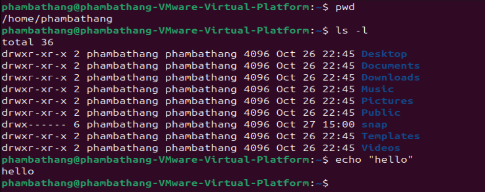

- Các lệnh cơ bản trong Linux:
    - `pwd`: Hiển thị đường dẫn hiện tại
    - `ls`: Liệt kê file/thư mục trong thư mục hiện tại
    - `cd`: Di chuyển vào thư mục
    - `clear`: Xóa màn hình Terminal, giúp dễ nhìn hơn
    - `history`: Hiển thị lịch sử các lệnh đã gõ
- Các phím tắt thông dụng:
    - `Tab`: Tự động gợi ý hoặc hoàn thành tên file/thư mục
    - `Ctrl + C`: Dừng/hủy tiến trình đang chạy trong terminal
    - `Ctrl + D`: Thoát khỏi shell hoặc kết thúc input (tương đương lệnh `exit`)
    - `Ctrl + L`: Xóa màn hình (giống lệnh `clear`)
- Cấu trúc đường dẫn trong Linux:
    - Đường dẫn tuyệt đối: Là đường dẫn bắt đầu từ thư mục gốc `/`
    - Đường dẫn tương đối: Là đường dẫn dựa trên thư mục hiện tại
    - Các ký hiệu đặc biệt trong đường dẫn:
        - `~`: Thư mục home của người dùng hiện tại
        - `.`: Thư mục hiện tại
        - `..`: Thư mục cha
        - `/`: Thư mục gốc của hệ thống

## Phần 3: Làm việc với file và thư mục
- Các lênh tạo, xem, sao chép, xóa và di chuyển file:
    - `touch <file>`: Tạo file rỗng mới hoặc cập nhật thời gian chỉnh sửa nếu file đã tồn tại
    - `cat <file>`: Hiển thị toàn bộ nội dung file
    - `less <file>`: Xem nội dung dài, có thể cuộn lên/xuống
    - `head <file`: Hiển thị 10 dòng đầu tiên (mặc định)
        - `head -n 5 file`: Để xem 5 dòng đầu
    - `tail <file>`: Hiển thị 10 dòng cuối cùng
    - `cp <nguồn> <đích>`: Sao chép file hoặc thư mục
        - `cp -r <thư_mục>`: Sao chép thư mục
    - `mv <nguồn> <đích>`: Di chuyển hoặc đổi tên file/thư mục
    - `rm <file>`: Xóa file
        - `rm -r <thư_mục>`: Xóa thư mục và toàn bộ nội dung bên trong
    - `mkdir <tên_thư_mục>`: Tạo thư mục mới
    - `rmdir <tên_thư_mục>`: Xóa thư mục rỗng
- Các lệnh nén và giải nén:
    - `tar -cvf file.tar <thư_mục>`: Nén thư mục thành file .tar
    - `tar -xvf file.tar`: Giải nén file .tar
    - `gzip <file>`: Nén file thành .gz
    - `gunzip <file.gz>`: Giải nén file .gz
    - `zip -r file.zip <thư_mục>`: Nén thư mục thành .zip
    - `unzip file.zip`: Giải nén file .zip
    - Các tùy chọn thường dùng:
        - `c`: tạo file nén mới
        - `x`: giải nén
        - `v`: hiển thị quá trình
        - `f`: chỉ định tên file
    - Phân biệt `tar`, `gzip`, `zip` và cách sử dụng:
        - `tar`: chỉ gộp các file/thư mục, nhưng ko nén
            - Dùng khi: Muốn đóng gói nhiều file mà không cần nén
        - `gzip`: chỉ nén 1 file đơn lẻ để giảm dung lượng, ko gộp
            - Dùng khi: Muốn nén 1 file riêng lẻ
        - `zip`: vừa gộp vừa nén
            - Dùng khi: Muốn nén cả thư mục lớn (gộp + nén) và chia sẻ qua Windows/macOS
- Sao chép file qua mạng bằng `scp`
    - `scp <file> user@host:/đường_dẫn>`: Sao chép file từ máy cục bộ sang máy từ xa
    - `scp user@host:/đường_dẫn ./`: Tải file từ máy từ xa về máy hiện tại
- Khái niệm về stream (luồng dữ liệu)
    - Trong Linux, mọi thứ đều được coi là luồng dữ liệu
    - **stdin**: Dữ liệu đầu vào (thường từ bàn phím) (số hiệu: 0)
    - **stdout**: Dữ liệu đầu ra bình thường (số hiệu: 1)
    - **stderr**: Dữ liệu lỗi (số hiệu: 2)
- Tìm kiếm file:
    - `find <đường_dẫn> [điều_kiện]`: tìm file theo điều kiện 
        - Ví dụ: `find /home -name "test.txt"`: tìm file có tên test.txt
    - Lệnh `locate`: tìm file nhanh hơn (dựa trên database)
        - Dùng như sau:
            ```bash
            sudo apt install mlocate -y
            sudo updatedb    
            locate nginx.conf
            ``` 
        - Tốc độ nhanh hơn `find` rất nhiều, nhưng kết quả có thể chưa cập nhật file mới nếu bạn chưa `updatedb`
    - Lệnh `grep`: tìm nội dung bên trong file
    - pipe (`|`): dùng để chuyển kết quả của lệnh trước -> lệnh sau
- **Thực hành**
    - Tạo thư mục thực hành
        - `mkdir ~/thuchanh_linux`
        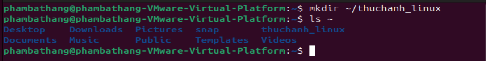
    - Tạo file trong thư mục
        - `cd ~/thuchanh_linux`
        - `touch bai1.txt bai2.txt`
        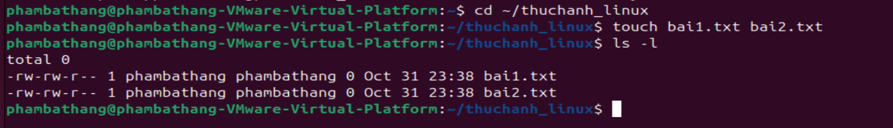
    - Viết nội dung vào file
        - `echo "Xin chao Linux" > bai1.txt`
        - `echo "hello Linux" > bai2.txt`
        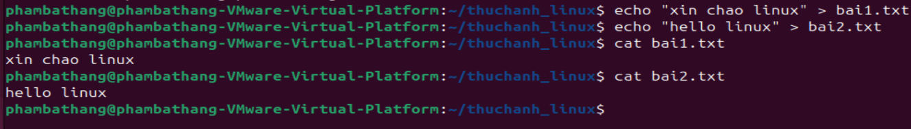
    - Tìm kiếm file theo 1 vài tiêu chí
        - Tìm kiếm theo tên: `find . -name "bai1.txt"`
        - Tìm kiếm theo phần mở rộng: `find . -name "*.txt"`
        - Tìm file được sửa trong 1 ngày qua: `find . -mtime -1`
        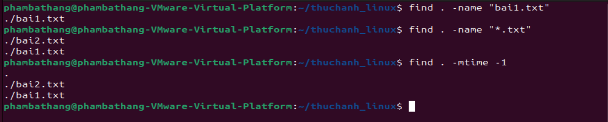
    - **(Phần 9)**: Tạo và nén backup thư mục
        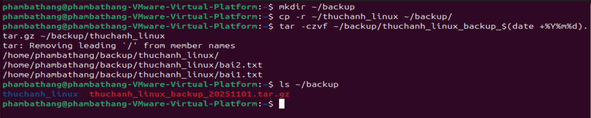
    - **(Phần 9)**: Dò tìm file lớn nhất trong thư mục home
        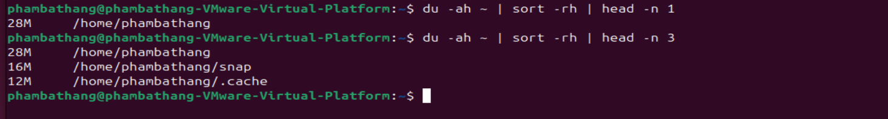

## Phần 4: Quyền truy cập và người dùng
- Người dùng là gì?
    - Mỗi tài khoản trong Linux là một thực thể độc lập, bao gồm:
        - Tên đăng nhập (username)
        - ID người dùng (UID)
        - Thư mục cá nhân (/home/username)
        - Quyền riêng trên file & thư mục
- Nhóm (group) là gì?
    - Là tập hợp người dùng có cùng quyền truy cập
    - Một người dùng có thể thuộc nhiều nhóm
- Một số lệnh cơ bản:
    - `whoami`: Hiển thị tên user hiện tại
    - `id`: Hiển thị UID, GID, nhóm
    - `adduser`: Tạo người dùng mới
    - `deluser`: Xóa người dùng
    - `su`: Chuyển sang tài khoản khác
    - `sudo`: Thực hiện lệnh với quyền root
    - `cat /etc/passwd`: Xem danh sách toàn bộ user trên hệ thống
- Phân quyền file
    - Mỗi file/thư mục trong Linux có 3 loại đối tượng
        - Chủ sở hữu - user (u): người tao ra file
        - Nhóm - group (g): những user cùng nhóm
        - Người khác - others (o): tất cả còn lại
    - Mỗi file/thư mục trong Linux có 3 loại quyền
        - Đọc (r) 4: xem nội dung
        - Ghi (w) 2: chỉnh sửa
        - Thực thi (x) 1: chạy file/script
- Lệnh `ls -l`: xem quyền
    - ví dụ:
    - Phân tích: 
- Lệnh `chmod`: thay đổi quyền
- Lệnh `chown`: thay đổi chủ sở hưu
- Lệnh `chgrp`: thay đổi nhóm sở hữu
- Quyền root và an toàn
    - Root là tài khoản quản trị cao nhất trong linux
    - Root có thể làm bất kỳ điều gì, kể cả xóa toàn bộ hệ thống
    - Tại sao không nên chạy mọi thứ bằng root?
        - Rất dễ xóa nhầm `/`hoặc `/etc` -> hệ thống hỏng hoàn toàn
        - Malware hoặc script độc hại có thể chiếm toàn quyền
        - Mất tính bảo mật và tách biệt người dùng
- Sự khác biệt giữa `suou` và `su`
    - `su`: Chuyển hẳn sang user khác
    - `sudo`: Chạy một lệnh duy nhất với quyền root
- **Thực hành**:
    - Tạo file và xem quyền mặc định
        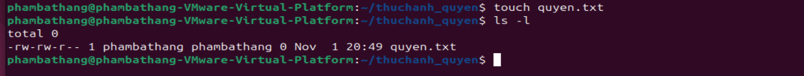
    - Thay đổi quyền và check lại
        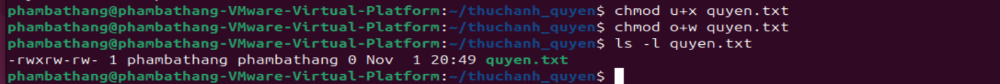
    - Tạo user mới
        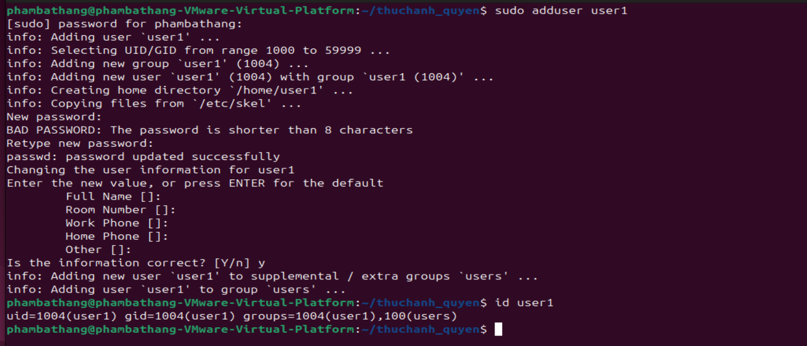
    - Thay đỏi own và group của file -> check
        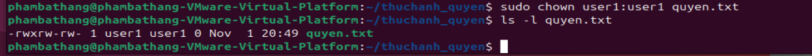
    - Phân quyền cho thư mục chia sẻ: mô phỏng trường hợp 2 user cùng làm việc trên cùng 1 thư mục dự án
        - Thêm user2
        - Tạo nhóm và thêm người dùng vào nhóm
            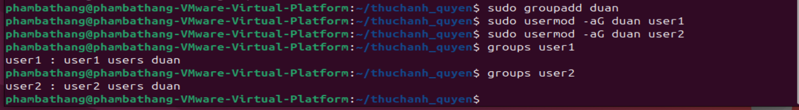
        - Tạo thư mục dự án và phân quyền
            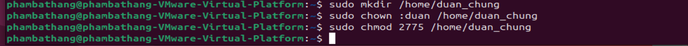
    - **(Phần 9)**: Tạo user mới, cấp quyền hạn chế
        - ví dụ: 
            - cho phép vào 1 thư mục cụ thể:
            - tạo thư mục riêng cho user này
            - -> chỉ đọc được `/home/restricted`, ko thể ghi ra ngoài thư mục của mình
        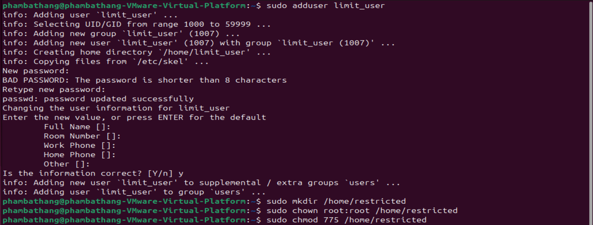
        
        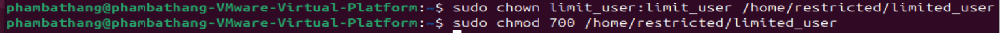

## Phần 5: Quản lý tiến trình và hệ thống
- Process là chương trình đang chạy trong hệ thống
- Mỗi tiến trình có:
    - PID (Process ID)
    - PPID (Parent Process ID)
    - Trạng thái: Running, Sleeping, Zombie, Stopped, ...
- Lệnh quản lý tiến trình cơ bản:
    - `ps`: Liệt kê tiến trình hiện tại
        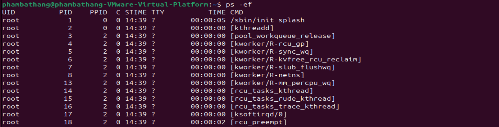
    - `top`: Theo dõi tiến trình đang chạy theo thời gian thực
        
    - `kill <PID>`: Dừng một tiến trình theo mã PID
    - `killall <tên tiến trình>`: Dừng tất cả tiến trình cùng tên
- Foreground và Background process
    - **Foreground**: Tiến trình chạy chiếm terminal (không gõ được lệnh khác)
    - **Background**: Tiến trình chạy ẩn sau, terminal vẫn rảnh để gõ lệnh khác
    - Thêm `&`: giúp tiến trình chạy nền. ko chiếm terminal
    - `jobs`: hiển thị danh sách tiến trình nền
    - `fg`: đưa tiến trình ra Foreground
    - Ctrl + Z rồi gõ `bg`: Đưa tiến trình foreground quay lại background
- Kiểm tra tài nguyên hệ thống
    - Lệnh `df -h`: hiển thị dung lượng ổ đĩa
        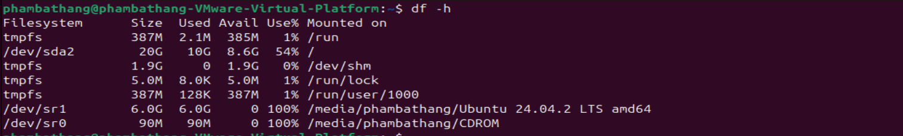
    - Lệnh `du -sh thumuc`: kiểm tra dung lượng thư mục cụ thể
        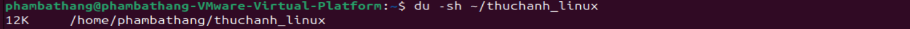
    - Lệnh `free -h`: xem RAM trống và sử dụng
        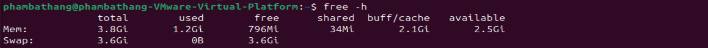
    - Lệnh `uptime`: xem thời gian hoạt động của máy
    - Lệnh `uname -a`: thông tin OS và kernel
        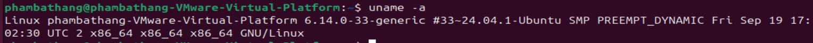
    - Lệnh `lscpu`: thông tin CPU
    - Lệnh `lsblk`: thông tin ổ đĩa
- Dịch vụ và tiến trình nền (Daemon)
    - Là tiến trình nền chạy tự động, không cần người dùng
    - Dịch vụ (service) là daemon được quản lý bởi systemd.
    - Lệnh `systemctl start <service>`: khởi động dịch vụ
    - Lệnh `systemctl stop <service>`: dừng dịch vụ
    - Lệnh `systemctl restart <service>`: khởi động lại dịch vụ
    - Lệnh `systemctl status <service>`: xem trạng thái dịch vụ
    - Lệnh `systemctl enable <service>`: bật tự khởi động khi boot
    - Lệnh `systemctl disable <service>`: tắt tự khởi động
    - Lệnh `journalctl -u <service>`: xem log của dịch vụ

## Phần 6: Quản lý gói phần mềm
- Trinh quản lý gói là công cụ giúp cài đặt, cập nhật, gỡ bỏ, và quản lý phần mềm trên hệ điều hành lInux
- Mỗi họ Linux có công cụ quản lý khác nhau
    - Ubuntu/Debian: `apt`, `apt-get` (.deb)
    - CentOS/RedHat/Fedora: `yum`, `dnf` (.rpm)
- Cài đặt và gỡ bỏ phần mền:
    - Lệnh `sudo apt update`: cập nhập danh sách gói
    - Lệnh `sudo apt upgrade`: nâng cấp toàn bộ hệ thống
    - Lệnh `sudo apt install <app>`: cài đặt phần mềm
    - Lệnh `sudo apt remove <app>`: gỡ bỏ phần mềm
    - Lệnh `sudo apt purge <app>`: gỡ bỏ hoàn toàn (kèm cả file cấu hình)
- Kiểm tra gói đang cài đặt:
    - Lệnh `dpkg -l`: xem danh sách tất cả package hiện có
    - Lệnh `dpkg -l | grep <app>`: tìm gói cụ thể
- Tạo và sử dụng alias (lệnh tắt):
    - Giúp tạo lệnh rút gọn cho những lệnh dài, hay dùng
    - Tạo alias tạm thời:
        - `alias ll='ls -alF'`: khi gõ ll hệ thống sẽ thực hiện `ls -alF`
        - alias này sẽ mất khi đóng terminal
    - Tạo alias vĩnh viễn:
        - mở file cấu hình shell: ~/.bashrc
        - thêm dòng: alias ll='ls -alF'
        - Lưu lại rồi tải lại file: source ~/.bashrc

## Phần 7: Làm việc với mạng (Networking)
- Lệnh kiểm tra mạng:
    - Lệnh `ping`: kiểm tra kết nối mạng hoặc máy chủ có phẩn hồi ko
        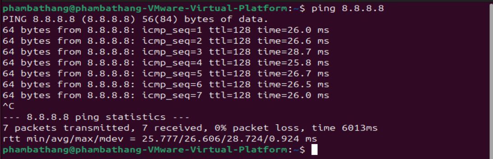
    - Lệnh `ifconfig` hoặc `ip addr show`: hiển thị thông tin địa chỉ IP, card mạng, MAC, ...
        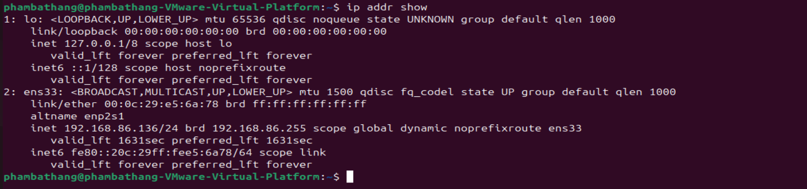
    - Lệnh `netstast` hoặc `ss`: Kết nối mạng đang mở và cổng đang lắng nghe
        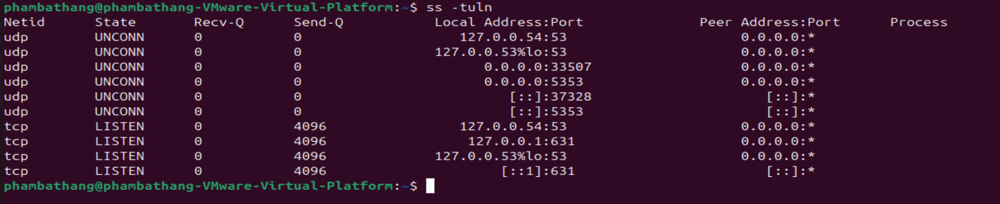
        - các option:
            - t : TCP
            - u : UDP
            - l : Listening
            - n : hiển thị số thay vì tên dịch vụ
    - Lệnh `curl` và `wget`: dùng để tải dữ liệu từ web hoặc kiểm tra API
- Kết nối SSH và truyề file:
    - Lệnh `ssh user@ip_server`: kết nối đến máy chủ từ xa
    - Truyền file an toàn giữa 2 máy qua SSH, ví dụ: `scp myfile.txt user@ip_server:/home/user/`: sao chép myfile.txt sang thư mục /home/user/ của máy đích
    - `rsync`: công cụ đồng bộ dữ liệu thông minh hơn `scp` (chỉ sao chép phần thay đổi)
- Thiết lập SSH key (đăng nhập ko cần mật khẩu)
- Kiểm tra cổng và firewall
    - `ss -tuln`: kiểm tra cổng đang mở
    - Cấu hình tường lửa cơ bản:
        - Bật firewall: `sudo ufw enable`
        - Ví dụ: Cho phép SSH (`sudo ufw allow 22`), cho phép web (`sudo ufw allow 80`, `sudo ufw allow 443`), ...
        - Xem trạng thái firewall: `sudo ufw status`
        - Dùng **iptables**:
            - Xem tất cả rule firewall hiện có: `sudo iptables -L -n -v`
- **Thực hành**
    - **(Phần 9)**: cấu hình SSH key
        - cài openssh-server   
        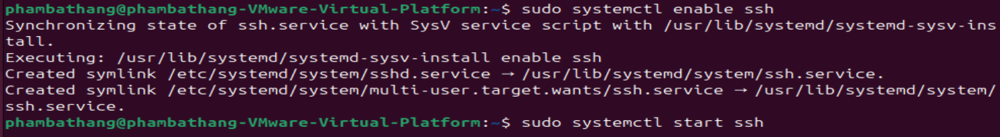
        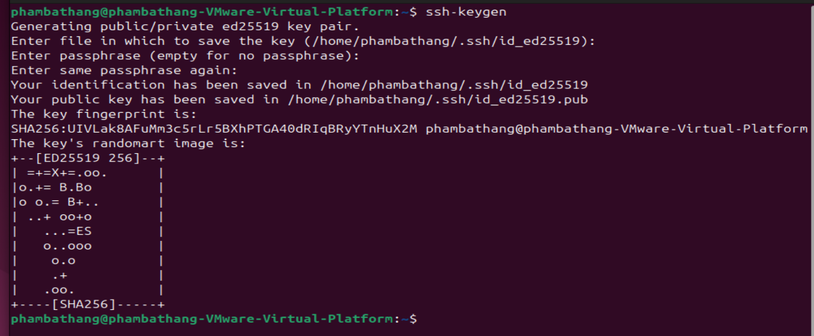
        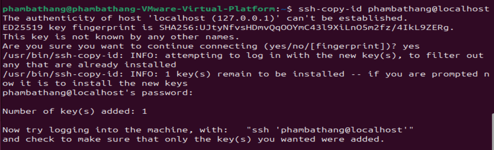
        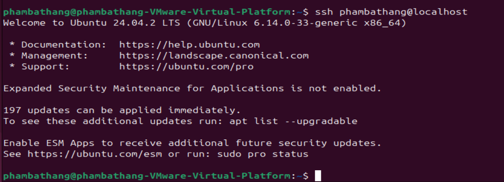

## Phần 8: Script & Automation cơ bản
- Shell script là tập hợp các lệnh linux được viết trong 1 file `.sh`, giúp tự động hóa công việc lặp lại
- Một script thường bắt đầu bằng dòng: **#!/bin/bash**
- Ví dụ: tạo 1 file script hello.sh
    - `nano hello.sh`
    - Thêm nội dung:
        ```bash
        #!/bin/bash
        echo "Hello, $USER! Welcome to Linux automation."
        ```
    - Lưu rồi chạy:
        - cách 1: `bash hello.sh`
        - cách 2: `chmod +x hello.sh` và `./hello.sh`
- Câu lệnh nhập xuất:
    - xuất dữ liệu : `echo`
    - nhập dữ liệu : `read`
        - `-p`: chỉ định 1 câu thông báo hướng dẫn nhập
        - `-s`: nhập mật khẩu mà ko hiển thị trên màn hình
        - `-a`: đọc và lưu dữ liệu vào mảng
- Cách phép toán so sánh:
    - `-eq`: bằng nhau
    - `-ne`: ko bằng nhau
    - `-lt`: nhỏ hơn
    - `-gt`: lớn hơn
    - `-le`: nhở hơn hoặc bằng
    - `-ge`: lớn hơn hoặc bàng
- Biến, vòng lặp và điều kiện
    - Cách khai báo biến và sử dụng:
        ```bash
        name="Thang"
        echo "Xin chào $name"
        ```
    - Biến môi trường có săn:
        - `$USER`: Tên người dùng hiện tại
        - `$HOME`: thư mục home
        - `$PWD`: thư mục hiện tại
        - `$HOSTNAME`: tên máy chủ
    - Cấu trúc điều kiên:
        ```bash
        if [ ... ]; then
		    code
	    else if [ ... ]; then
		    code
	    else
		    code
	    fi
        ```
    - vòng lặp for:
        ```bash
        for i in {1..n}; do
			code
		done
        ```
    - vòng lặp ưhile:
        ```bash
        count=1
		while [ $count -le n]; do
			code
			((count++))
		done 
        ```
- Tự động hóa tác vụ
    - Cron job trong hệ điều hành Linux là một công cụ giúp bạn lên lịch thực thi các tác vụ tự động vào một thời điểm cụ thể
    - Cronjob của Linux được quản lý ở file: /etc/crontab
    - Một số câu lệnh: 
        - `crontab -l`: list tất cả cronjob của user hiện tại
        - `sudo crontab -l`: list tất cả cronjob của user root
        - `crontab -e` hoặc `sudo crontab -e`: edit một cronjob
- **Thực hành**:
    - **(Phần 9)**: Viết script tự động sao lưu log hệ thống hàng ngày 
        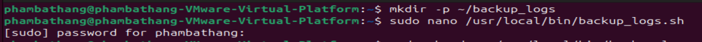
        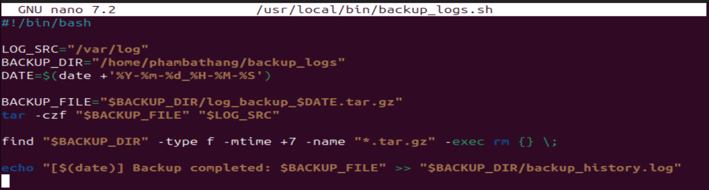
        
        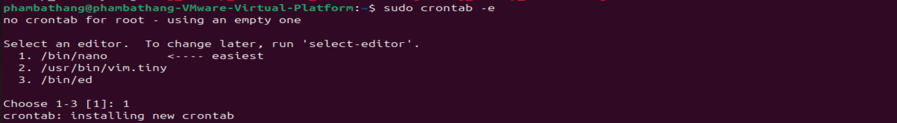
        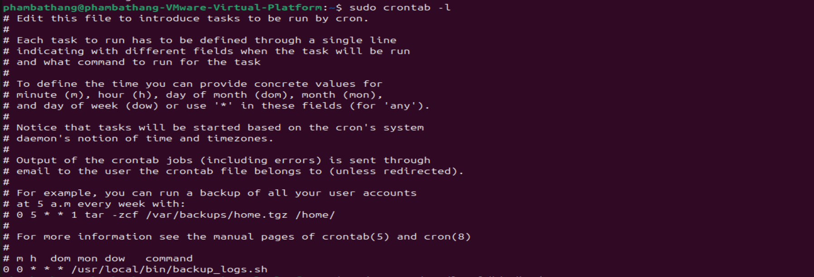
## Phần 9: Thực hành mở rộng
- Cấu hình bảo mật SH
    - 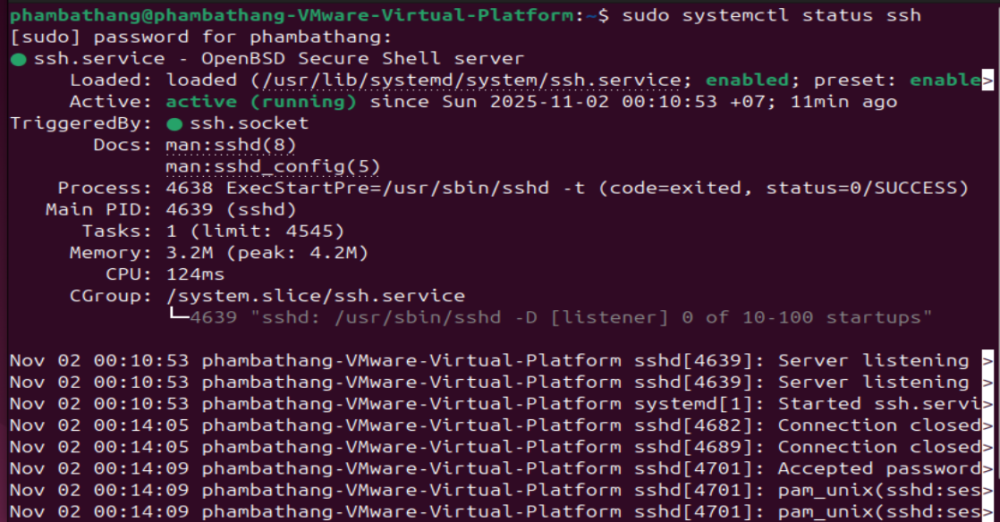
    - Dổi port ssh sang 2222
        - `sudo nano /etc/ssh/sshd_config`
        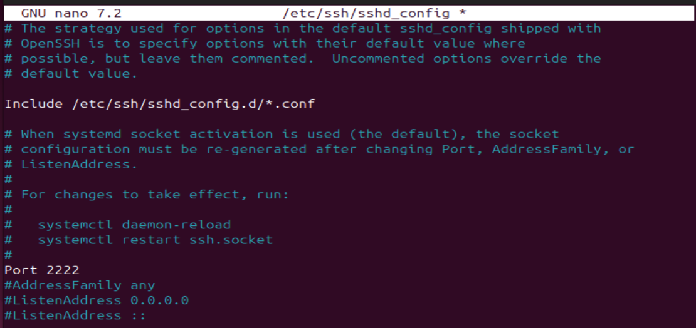
    - cấm đăng nhập root qua ssh
        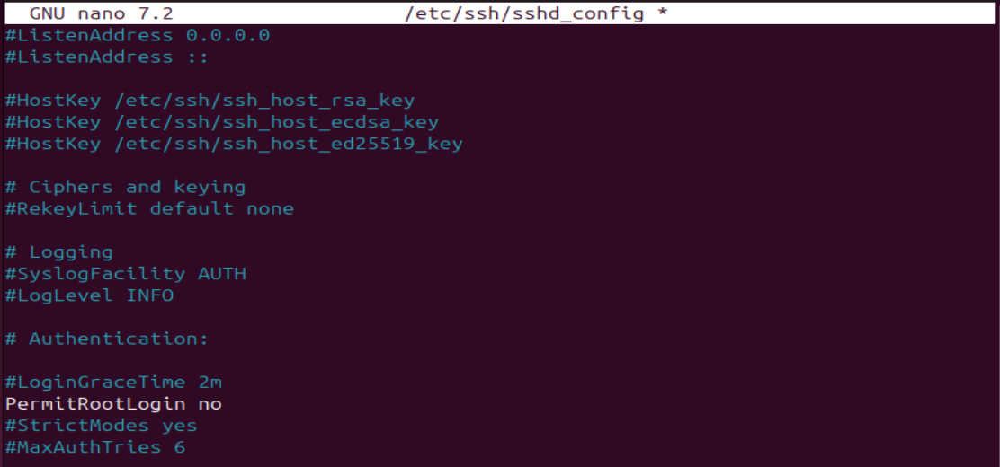
    - bắt buộc dùng ssh key thay vì mật khẩu
        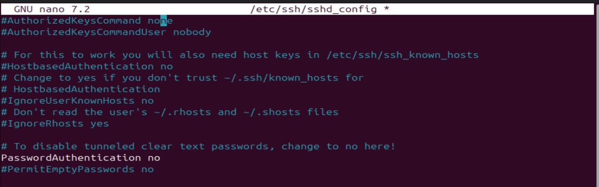
    - khởi động lại
        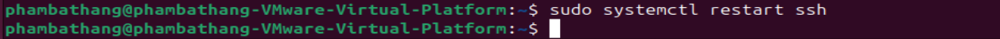
    - Cài và cấu hình Fail2Ban
        - `sudo apt install fail2ban -y`
        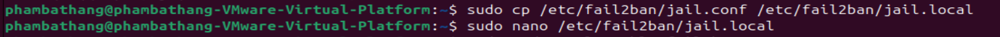
        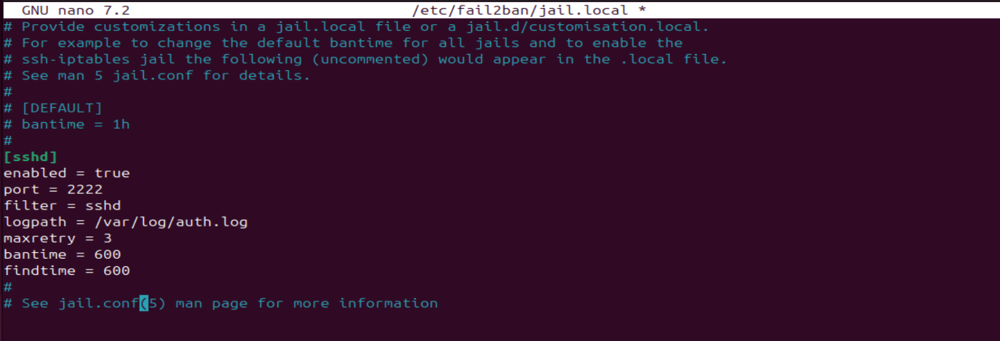
        - Khởi động dịch vụ
        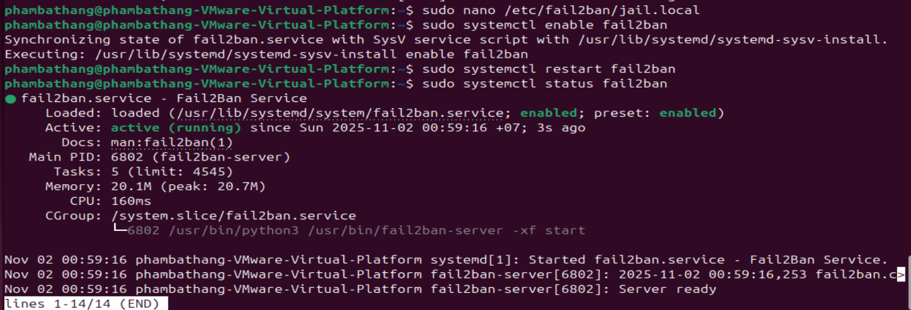

- Thiết lập tường lửa
    - khởi dộng và kiểm tra trạng thái
        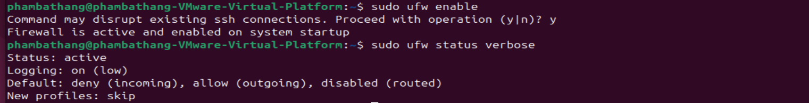
    - Thiết lâoj rule cơ bản:
        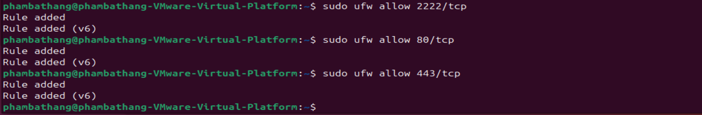
    - kiểm tra lại cấu hình:
        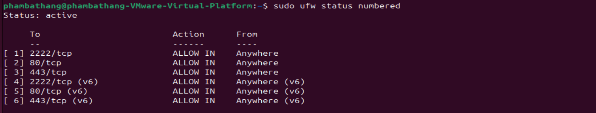

- Dò lỗ hổng hệ thống bằng Lynis
    - cài đặt: `sudo apt install lynis -y`
    - chạy quét toàn hệ thống: `sudo lynis audit system`
    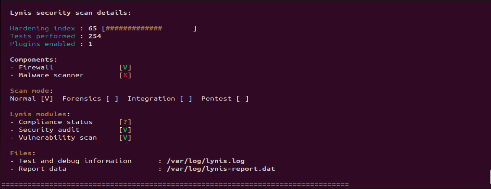
