# Báo cáo tuần 3: Ảo hóa và Container

## Phần 1: Tổng quan về ảo hóa
- Khái niệm **Ảo hóa**: là công nghệ cho phép tạo ra các phiên bản "ảo" của tài nguyên phần cứng hoặc phần mềm thực tế
    - Ví dụ: server, hệ điều hành, mạng, ...
- Mục đích của **Ảo hóa**: nó ra đời nhằm tối ưu hóa việc sử dụng tài nguyên và tăng tính linh hoạt trong quản lí hệ thống
    - Tận dụng tối đa tài nguyên phần cứng: Thay vì để CPU, RAM của máy chủ vật lý bị lãng phí, ta có thể chia nhỏ ra cho nhiều VM cùng chạy
    - Tiết kiệm chi phí: Giảm số lượng máy vật lý phải mua, tiết kiệm điện năng, bảo trì, và không gian
    - Tăng khả năng linh hoạt và mở rộng: Dễ dàng tạo mới, sao chép hoặc di chuyển VM sang máy khác mà không gián đoạn dịch vụ
    - Dễ quản lý và backup: Có thể snapshot, clone hoặc phục hồi hệ thống nhanh chóng
    - Tăng tính an toàn: Cách ly giữa các VM -> nếu một VM bị tấn công thì không ảnh hưởng VM khác
- Phân loại **Ảo hóa**:
    - **Ảo hóa phần cứng (Hardware Virtualization)**: Tạo ra các máy ảo (VM) chạy trên 1 máy vật lý, nhờ phần mềm gọi là **Hypervisor**
    - **Ảo hóa hệ điều hành (OS-level Virtualization)**: Chia sẻ chung kernel, nhưng tạo môi trường cô lập (container) cho từng ứng dụng
    - **Ảo hóa lưu trữ (Storage Virtualization)**: Gom nhiều ổ đĩa vật lý thành một hệ thống lưu trữ ảo thống nhất
    - **Ảo hóa mạng (Network Virtualization)**: Ảo hóa thiết bị mạng: switch, router, firewall,... giúp quản lý linh hoạt
    - **Ảo hóa ứng dụng (Application Virtualization)**: Cho phép chạy ứng dụng trong môi trường ảo riêng biệt mà không cần cài đặt trực tiếp
- Các công nghệ **Ảo hóa** phổ biến hiện nay:
    - **VMware vSphere / ESXi** (ảo hóa phần cứng): Hypervisor mạnh mẽ, dùng trong doanh nghiệp
    - **KVM (Kernel-based Virtual Machine)** (ảo hóa phần cứng): Tích hợp trong Linux kernel, mã nguồn mở
    - **Microsoft Hyper-V** (ảo hóa phần cứng): Dùng trên Windows Server và Windows 10/11 Pro
    - **Xen** (ảo hóa phần cứng): Mã nguồn mở, dùng trong cloud như AWS
    - **Docker** (ảo hóa hệ điều hành): Tạo container nhẹ, chia sẻ kernel Linux
    - **LXC (Linux Containers)** (ảo hóa hệ điều hành): Dạng container cơ bản trên Linux.
    - **Proxmox VE** (Kết hợp VM + Container): Dùng cả KVM và LXC, quản lý qua web
- Tìm hiểu về **Virtual Machine**:
    - Khái niệm: là một máy tính ảo được tạo ra bằng phần mềm (**HHypervisor**), chạy trên máy chủ vật lý (**Host**)
    - Mỗi VM có hệ điều hành (Guest OS) và ứng dụng riêng, hoạt động độc lập như máy thật
    - Các thành phần được ảo hóa trong một VM:
        - **CPU**: Mỗi VM được cấp một hoặc nhiều CPU ảo (vCPU)
        - **RAM**: Cấp phát bộ nhớ ảo cho VM
        - **Storage (ổ đĩa)**: VM dùng ổ đĩa ảo (VDI, VMDK, QCOW2) lưu trong máy host
        - **Network (card mạng)**: Card mạng ảo kết nối với mạng ảo hoặc bridge ra mạng thật
        - **Thiết bị I/O (USB, GPU,...)**: Có thể được pass-through cho VM sử dụng trực tiếp
- **Ảo hoá** được hỗ trợ bởi phần cứng: Hiện nay CPU hiện đại (Intel, AMD) hỗ trợ trực tiếp ảo hóa
    - **Intel VT-x**: Hỗ trợ chạy nhiều OS đồng thời, tăng hiệu năng VM
    - **AMD-V**: Tương tự Intel VT-x, tăng tốc thực thi mã trong VM
- **Ảo hoá toàn phần** vs **Ảo hoá bán phần**:
    - Ảo hoá toàn phần: Guest OS không cần chỉnh sửa, chạy độc lập hoàn toàn nhờ hypervisor mô phỏng toàn bộ phần cứng
    - Ảo hoá bán phần: Guest OS được chỉnh sửa để giao tiếp trực tiếp với hypervisor, giúp tăng hiệu suất
- Vòng đời của VM:
    - **Tạo (Create)**: Cấp CPU, RAM, Disk, Network
    - **Cấu hình (Configure)**: Chọn OS, driver, snapshot
    - **Khởi động (Start/Boot)**: Nạp hệ điều hành
    - **Vận hành (Run)**: Thực thi ứng dụng, sử dụng tài nguyên
    - **Tạm dừng / Snapshot (Pause / Save)**: Lưu trạng thái để khôi phục nhanh
    - **Tắt (Shutdown)**: Giải phóng tài nguyên
    - **Xóa (Delete)**: Gỡ bỏ hoàn toàn VM
- Quản lý VM:
    - Tạo mới / clone / snapshot
    - Giám sát hiệu suất (CPU, RAM, disk
    - Quản lý tài nguyên chia sẻ
    - Di chuyển VM giữa các host (Live Migration)
    - Backup / Restore

## Phần 2: Container
### 2.1. Tổng quan về Container
- **Container**: là một môi trường ảo hóa nhẹ cho phép đóng gói ứng dụng cùng tất cả thư viện, cấu hình, ... vào một đơn vị độc lập có thể chạy ở bất kỳ đâu
- Tại sao cần Container?
    - Các vấn đề khi sử dụng VM:
        - Xung đột version giữa Library, Binary, Runtime cùng cài trên các VM
        - Không có khả năng độc lập môi trường giữa các ứng dụng
        - Mất thời gian trong việc triển khai (chuẩn bị OS, cài các library cần thiết, setup môi trường, ...)
        - Khó đảm bảo tính nhất quán của ứng dụng được triển khai
    - Container ra đời để giải quyết những vấn đề trên:
        - Đóng gói ứng dụng cùng với những thứ cần thiết để chạy được ứng dụng đó thành một image có thể run ở bất cứ đâu có hỗ trợ container
        - Cung cấp môi trường và cơ chế cấp phát tài nguyên để image đó có thể run được
        - Cung cấp cơ chế và công cụ cho phép các nhà phát triển đóng gói, lưu trữ, phân phối và triển khai ứng dụng một cách thuận tiện
- Lợi ích của việc sử dụng Container:
    - **Độc lập với môi trường**: Containers cung cấp một cách để đóng gói ứng dụng và tất cả các dependencies của nó, bao gồm OS, libraries, tools. Nó cho phép ứng dụng chạy một cách độc lập và nhất quán trên bất kỳ môi trường nào
    - **Đơn giản hóa quy trình triển khai**: tính nhất quán, tốc độ, thuận tiện là những gì Containerlize mang lại khi so sánh với mô hình truyền thống
    - **Quản lý tài nguyên hiệu quả**: triển khai ứng dụng bằng Container cho phép bạn chia sẻ và sử dụng tài nguyên của hệ thống một cách hiệu quả. Bằng cách chạy nhiều container trên cùng một máy chủ vật lý hoặc máy ảo, bạn có thể tận dụng tối đa khả năng tính toán và tài nguyên của hệ thống
    - **Linh hoạt và mở rộng**: Containers cho phép bạn dễ dàng mở rộng ứng dụng theo nhu cầu. Bằng cách scale horizontal, ứng dụng có thể mở rộng để đáp ứng workload. Ngoài ra, việc triển khai nhiều version của một ứng dụng cùng lúc cũng trở nên dễ dàng
- So sánh Container và VM

| Tiêu chí | Virtual Machine (VM) | Container |
|----------|----------------------|-----------|
| Cấu trúc | Mỗi VM có HĐH riêng (Guest OS) | Container chia sẻ kernel HĐH host |
| Hiệu năng | Tốn tài nguyên, khởi động chậm | Nhẹ, khởi động nhanh (vài giây) |
| Cách ly (Isolation) | Cách ly hoàn toàn bằng Hypervisor | Cách ly ở mức tiến trình (namespace, cgroup) |
| Dung lượng image | Hàng GB (cả OS) | Vài chục MB |
| Khả năng di chuyển | Khó mang sang môi trường khác | Dễ di chuyển, chạy được ở mọi nơi có Docker |
| Ứng dụng điển hình | Ảo hóa máy chủ, hệ thống lớn | Triển khai microservices, CI/CD, DevOps |

### 2.2. Docker
- **Docker** là gì?
    - Docker là phần mềm cho phép dựng, kiểm thử, và triển khai ứng dụng một cách nhanh chóng
    - Docker đóng gói phần mềm vào các đơn vị tiêu chuẩn hóa được gọi là **container**
    - Có thể nhanh chóng triển khai và thay đổi quy mô ứng dụng vào bất kỳ môi trường nào và biết chắc rằng code sẽ chạy được **(build one – run anywhere)**
- Các thành phần cơ bản củ **Docker**:

    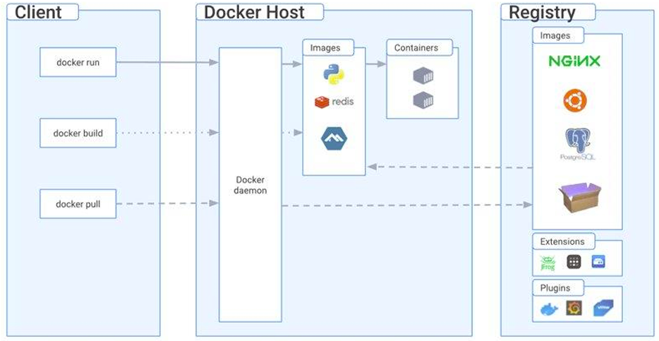

    - **Docker daemon**: là nơi quản lý các thành phần của Docker như image, container, volume, network
    - **Docker Client**: Cung cấp phương thức để tương tác với Docker daemon
    - **Docker registry**: nơi lưu trữ các docker image. Mặc định docker sẽ connect tới docker registry là Docker hub
- Các bước cơ bản để xây dựng ứng dụng Docker:
    - **Chuẩn bị Dockerfile**: Mô tả các bước cần thiết để tạo ra môi trường container chứa ứng dụng
    - **Build Docker Image**: Sử dụng lệnh `docker build` để xây dựng Docker Image từ Dockerfile
    - **Kiểm tra Docker Image**: Sử dụng lệnh `docker images` để kiểm tra danh sách các Docker Image có sẵn trên máy
    - **Chạy Docker Container**: Sử dụng lệnh `docker run` để chạy một container từ Docker Image
    - **Kiểm tra ứng dụng**: Truy cập ứng dụng thông qua địa chỉ IP hoặc tên miền cùng với port đã chỉ định
- **Cài đặt Docker (Linux)**:

    

    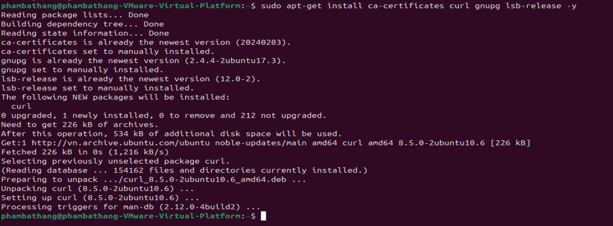

    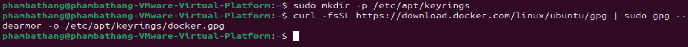

    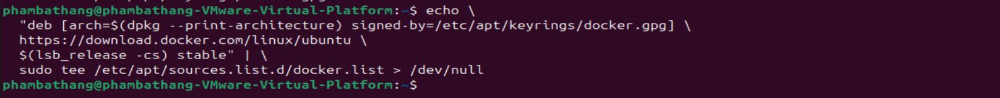

    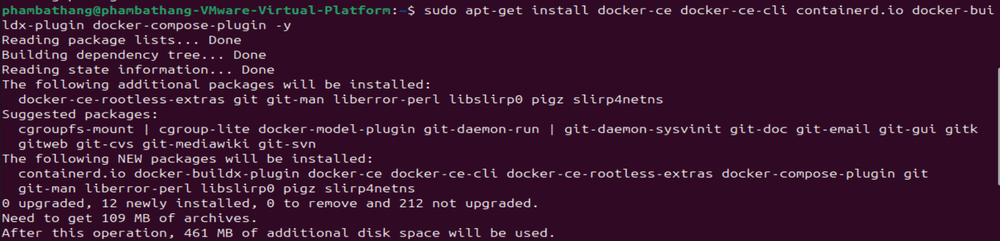

    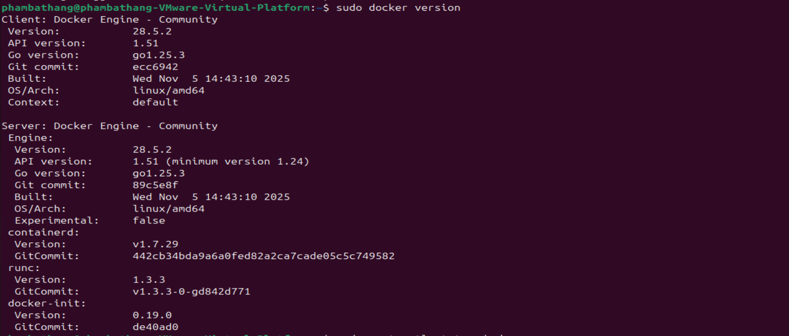

    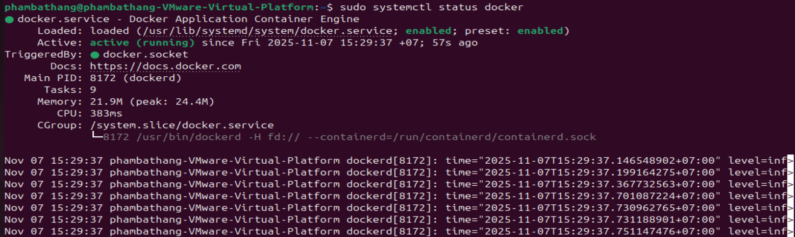

- Cấu hình proxy:
    - Cho docker daemon: 
        ```bash
        sudo mkdir -p /etc/systemd/system/docker.service.d
        sudo nano /etc/systemd/system/docker.service.d/proxy.conf
        ```

        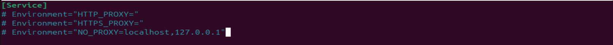

    - Cho docker client: 
        ```bash
        mkdir -p ~/.docker
        nano ~/.docker/config.json
        ```
        
        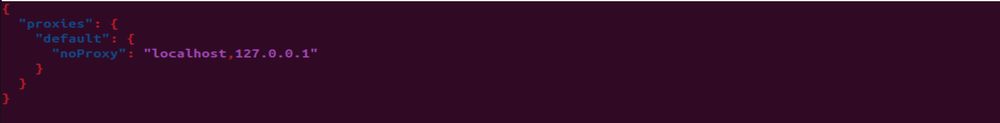

- Cấu hình trusted registry trong daemon.json tham khảo Local Repos
    - `sudo nano /etc/docker/daemon.json`
    
    

    - `sudo systemctl restart docker`
- Hello world với Docker
    
    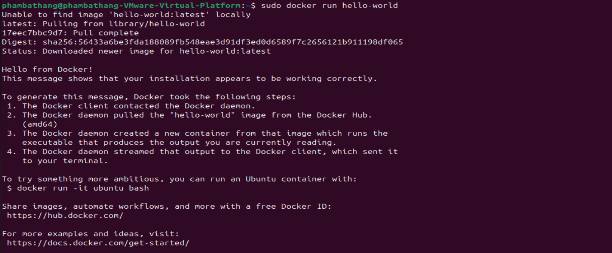

- **Các câu lệnh cơ bản với Docker**:
    - `docker pull <image>`: Tải image từ registry về máy
    - `docker run <image>`: Tạo và chạy container từ image
    - `docker build -t <tag> .`: Build image từ Dockerfile
    - `docker tag <src> <dest>`: Đặt tên mới cho image
    - `docker push <image>`: Đẩy image lên registry
- **Tìm hiểu về Dockerfile**:
    - **FROM**: Để chỉ định base image mà Docker image sẽ dựa trên
    - **WORKDIR**: Chỉ định thư mục làm việc mặc định
    - **COPY** hoặc **ADD**: Sao chép các tệp và thư mục từ máy chủ nơi Dockerfile được chạy vào bên trong Docker image
    - **RUN**: Có thể thực thi các lệnh bên trong quá trình build image
    - **ENV**: Để định nghĩa các biến môi trường cho Docker image
    - **EXPOSE**: xác định các port mà ứng dụng trong Docker Image sẽ lắng nghe
    - **CMD** và **ENTRYPOINT**: Chỉ định lệnh mà Docker sẽ chạy khi khởi động một container từ image
- Phân biệt COPY và ADD:
    - ADD hỗ trợ giải nén trong quá trình copy, copy từ URL trên Internet
    - COPY không hỗ trợ giải nén hoặc hỗ trợ URL trên Internet
- Phân biệt CMD và ENTRYPOINT:
    - ENTRYPOINT định nghĩa process sẽ được thực thi bên trong container
    - CMDđịnh nghĩa tham số mặc định cung cấp cho entrypoint process
- **Docker network**:
    - Network là môi trường kết nối giữa các container, cho phép chúng giao tiếp qua IP hoặc tên (hostname)
    - Khi một container chạy, Docker tự động gán cho nó địa chỉ IP riêng trong một mạng ảo
    - Các loại network:
        - **Bridge**: Dành cho các container độc lập muốn giao tiếp trong cùng một host
        - **Host**: Container dùng network stack của host, không bị tách biệt IP
        - **None**: Không có network (container bị cô lập hoàn toàn)
        - **Overlay**: Dành cho Swarm / multi-host, kết nối container trên nhiều host khác nhau
        - **Macvlan**: Gán địa chỉ MAC/IP thật từ mạng vật lý cho container
    - Các lện thao tác với network:
        - `docker network ls`: liệt kê các network
        - `docker network inspect mynet`: xem chi tiết cấu hình và container trong mạng
        - `docker network create <name>`: tạo network mới
        - `docker network rm <name>`: xóa network
        - `docker network connect <network> <container>`: thêm container vào network
        - `docker network disconnect <network> <container>`: ngắt container khỏi network
- **Docker volume, mount**:
    - Docker volume: là vùng lưu trữ dữ liệu do Docker quản lý, nằm ngoài container. Nó cho phép giữ lại dữ liệu ngay cả khi container bị xóa
        - Câu lệnh tạo volume: `docker volume create mydata`
        - Câu lệnh gắn volume vào container: `docker run -d --name db -v mydata:/data busybox`
    - Docker mount: là cơ chế gắn một thư mục hoặc file từ host vào container
        - `docker volume ls`: liệt kê các volume
        - `docker volume inspect mydata`: xem chi tiết volume
        - `docker volume rm mydata`: xóa voulume
        - `docker volume prune`: xóa tất cả các volume ko dùng
- **Doker-compose**:
    - Docker Compose là một công cụ dùng để định nghĩa và chạy các ứng dụng multi-container trong Docker
    - Nó cho phép định nghĩa các service, network, volumes và các cấu hình khác trong một file YAML duy nhất
    - Cú pháp Docker-compose cơ bản:
        - **service**: đơn vị quản lý của docker-compose
        - **build**: chỉ thị dùng dockerfile nào để build ra docker image
        - **port**: mapping giữa hostport:container-port
        - **volume**: mapping giữa thư mục của máy host và container
        - **enviroment**: khai báo biến môi trường 
        - **volumes**: định nghĩa các persistent volume cho service

## Phần 3: Mini-lab
### 3.1. Triển khai trên VM
- Cài đặt nodejs:

    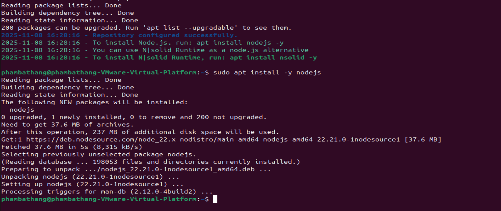

- Cài đặt mysql-server và setup database:

    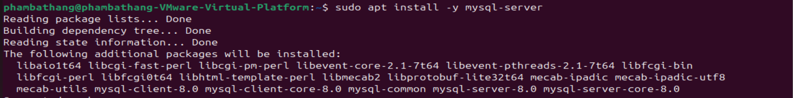

    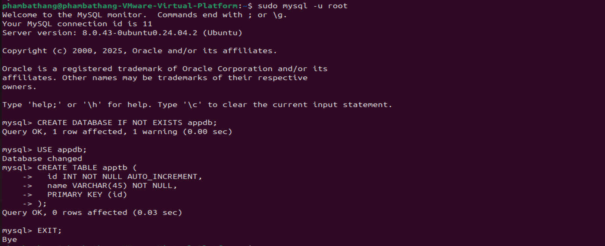

- Tạo user mới để kết nối database:

    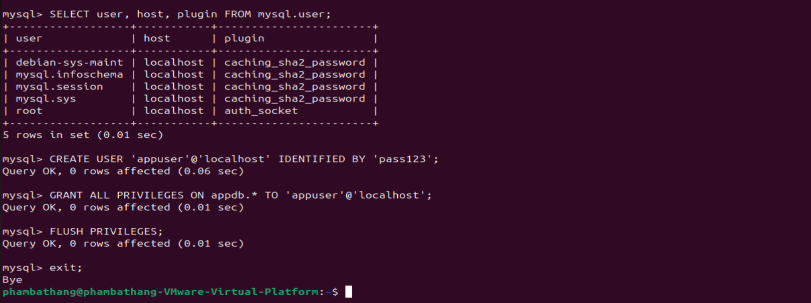

- Build và run backend: port 3001

    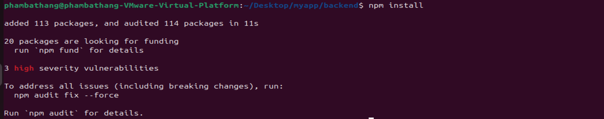

    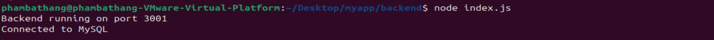

- Build và Run frontend: port 3000
    - `npm install`
    - `npm start`

    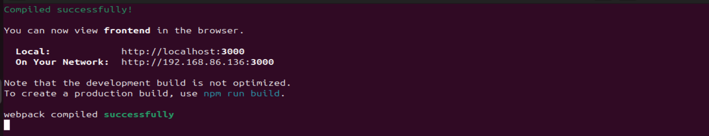

- Test truy cập qua localhost:3000, thực hiện 1 vài thao tác:
    
    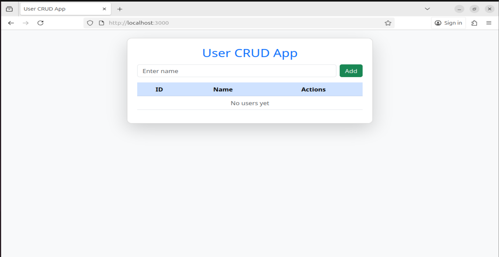

    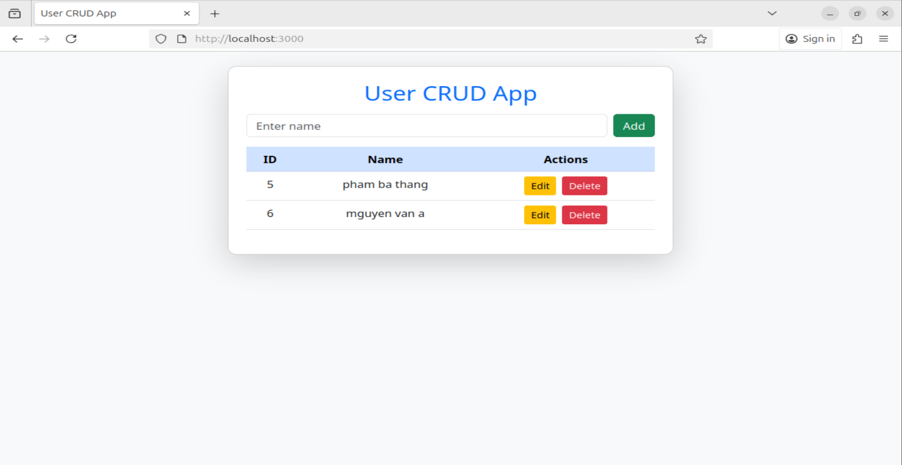

    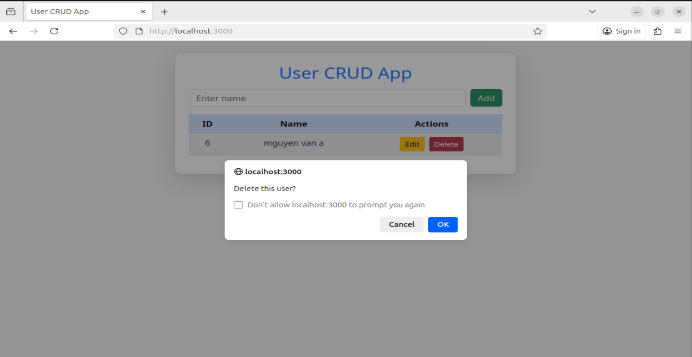

### 3.2. Triển khai bằng Container
- Dockerfile cho frontend
    ```yml
    FROM node:18-alpine

    WORKDIR /app

    COPY package*.json ./

    RUN npm install

    COPY . .

    EXPOSE 3000

    CMD ["npm", "start"]
    ```
- Dcokerfile cho backemd
    ```yml
    FROM node:18-alpine

    WORKDIR /app

    COPY package*.json ./

    RUN npm install

    COPY . .

    EXPOSE 3001

    CMD ["node", "index.js"]
    ```
- Docker-compose
    ```yml
    version: "3.9"

    services:
    db:
        image: mysql:8.0
        container_name: mysql_container
        environment:
        MYSQL_ROOT_PASSWORD: pass123
        MYSQL_DATABASE: appdb
        MYSQL_USER: appuser
        MYSQL_PASSWORD: pass123
        volumes:
        - db_data:/var/lib/mysql
        networks:
        - appnet

    backend:
        build: ./backend
        container_name: backend_container
        environment:
        DB_HOST: db
        DB_USER: appuser
        DB_PASSWORD: pass123
        DB_NAME: appdb
        ports:
        - "3001:3001"
        depends_on:
        - db
        networks:
        - appnet

    frontend:
        build: ./frontend
        container_name: frontend_container
        ports:
        - "3000:3000"
        environment:
        - CHOKIDAR_USEPOLLING=true
        - REACT_APP_BACKEND_URL=http://backend:3001
        depends_on:
        - backend
        networks:
        - appnet

    networks:
    appnet:
        driver: bridge

    volumes:
    db_data:
    ```
- Chạy lệnh: `sudo docker-compose up -d --build`
    - Check xem các container đang chạy: `sudo docker ps`
    
    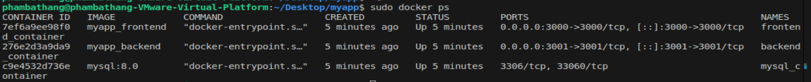

- Test truy cập:

    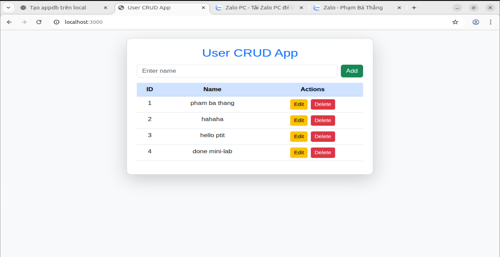
