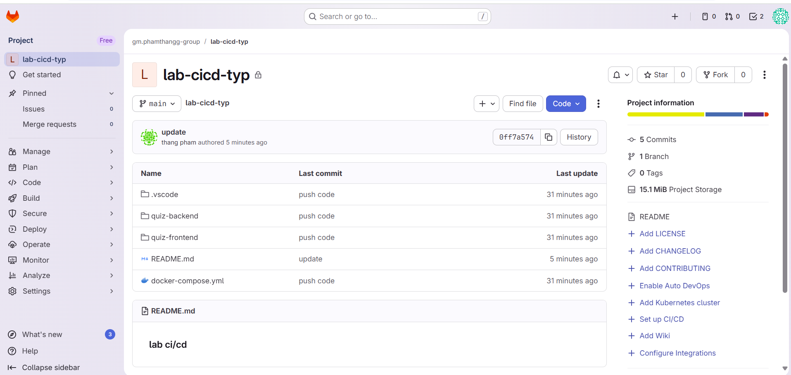
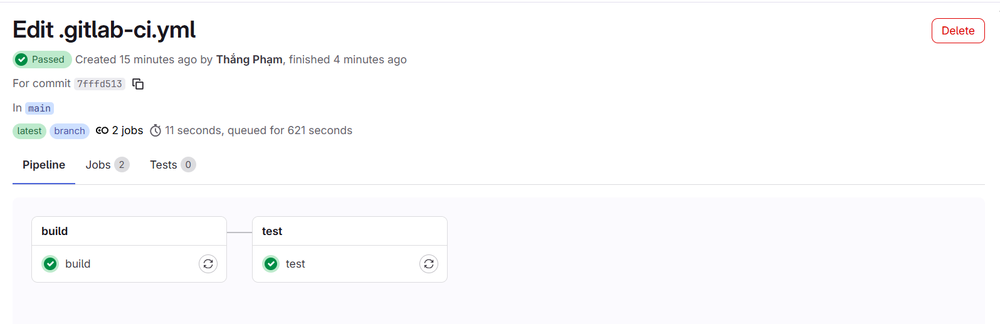
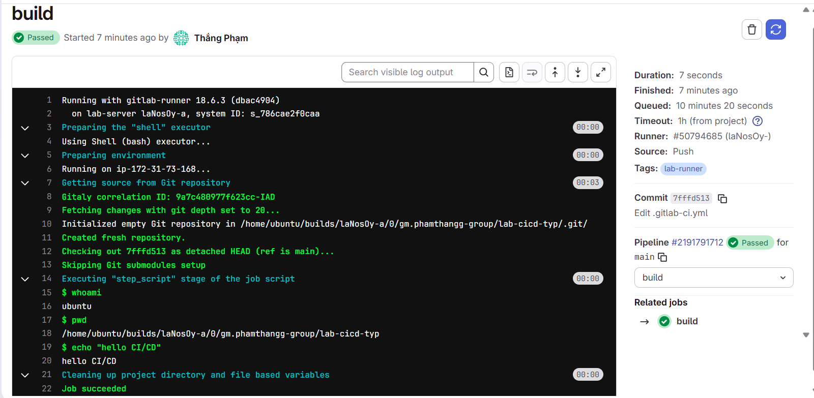
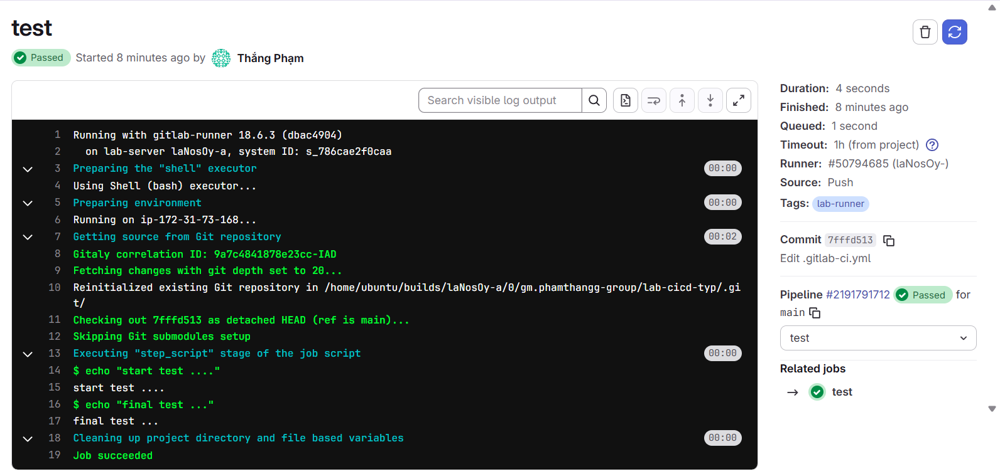
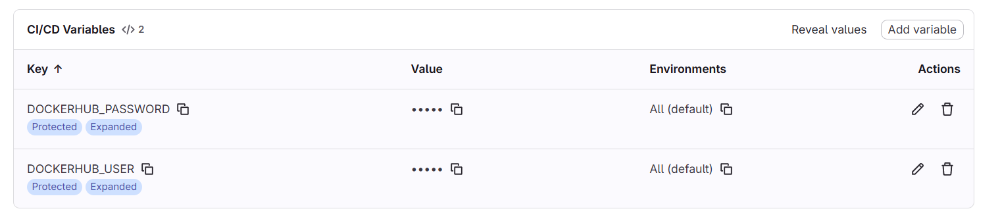
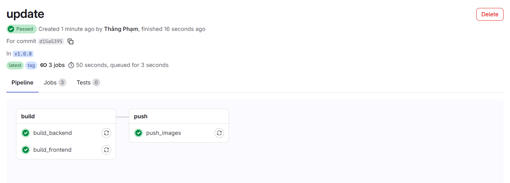
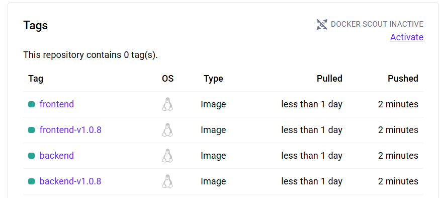
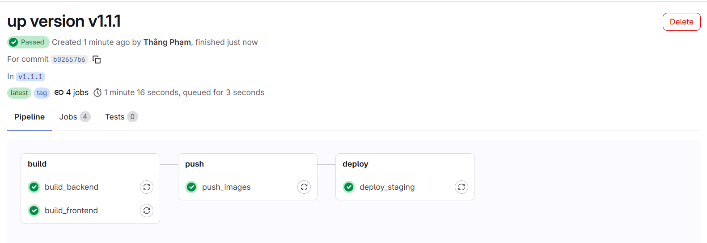
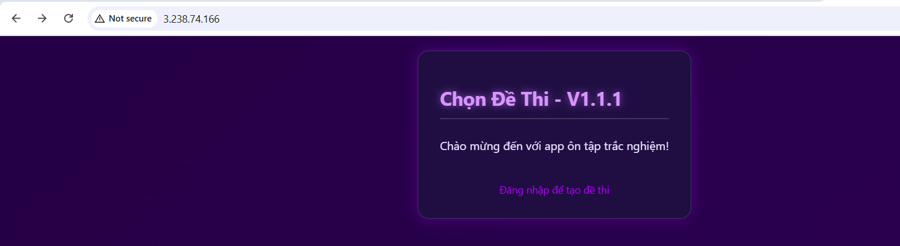

## Báo cáo CI/CD với GitLab

### 1. Mở đầu về CI/CD
- **Khái quát về CI/CD**
    - Trong thực tế, CI/CD là việc thay thế các bước thủ công, lặp đi lặp lại bằng một hệ thống tự động hóa hoàn toàn mà các lập trình viên chỉ cần tương tác qua Git.
    - Các lợi ích của CI/CD:
        - Tốc độ phát hành nhanh
        - Độ tin cậy và chất lượng được đảm bảo
        - Khả năng hồi phụ nhanh, giẩm thiểu downtime
        - Tối ưu hóa nguồn lực và giảm chi phí vận hành 
- **Tạo repo Gitlab và đẩy source code lên**
    - Tạo repo ở local và thao tác để push lên Gitlab repo tương tự như làm việc với Github

    

- **Tìm hiểu cơ bản về file `.gitlab-ci.yml`**
    - `.gitlab-ci.yml` là một file cấu hình được đặt tại thư mục gốc của dự án, và hướng dẫn cho GitLab Runner những công việc cần làm khi có thay đổi trong mã nguồn
    - File tổ chức công việc thành 2 phần chính: **Stages** và **Jobs**
    - **Stages**: Là các giai đoạn logic của pipeline (build, test, ...)
        - Các Stages được thực thi tuần tự (theo thứ tự từ trên xuống dưới). Một Stage sẽ không bắt đầu cho đến khi tất cả các Jobs trong Stage trước đó hoàn thành thành công
        - Định nghĩa các stages:
        ```yml
        stages:
          - build
          - test
          - deploy
          - ...
        ```
    - **Jobs**: Là các tác vụ cụ thể sẽ được thực hiện
        - Các Jobs trong cùng một Stage được thực thi song song để tăng tốc độ pipeline
        - Khai báo cái Jobs:
        ```yml
        stages:
          - build
          - ...

        Job_name: 
          stage: build  
          script:        
            - echo "Bắt đầu biên dịch..."
            - mvn clean package
        ```
    - Một vài từ khóa quan trọng:
        - **stage**: Chỉ định Job thuộc về Stage nào đã được định nghĩa
        - **script**: Là danh sách các lệnh shell sẽ được Runner thực thi
        - **image**: Chỉ định môi trường Docker container mà Job sẽ chạy bên trong
        - **only / except**: Điều kiện để Job được chạy. Xác định Job chỉ chạy trên branch/tag/event nào
        - **tags**: Yêu cầu Runner có tags cụ thể để thực thi Job này
        - **artifacts**: Các file hoặc thư mục được tạo ra bởi Job, được lưu lại để tải xuống hoặc chuyển sang các Jobs/Stages tiếp theo
- **Cài đặt Gitlab Runner**
    - Sử dụng 1 con EC2 instance làm runner
    - Đã cài đặt và đăng kí thành công:

    

    - Thử với vài stage đơn giản:
    ```yml
    stages:
      - build
      - test

    build:
      stage: build
      script:
        - whoami
        - pwd
        - echo "hello CI/CD"
      tags:
        - lab-runner

    test:
      stage: test
      script:
        - echo "start test ...."
        - echo "final test ..."
      tags:
        - lab-runner
    ```
    - Đã chạy lần đầu thành công:

    

    - Check thử log khi chạy:

    

    

- **Sử dụng variable để quản lý thông tin (username, password, ...)**
    - Lưu và quản lý các giá trị cấu hình để không phải hard-code trong pipeline, giúp pipeline dễ sửa, dễ tái sử dụng và bảo mật thông tin nhạy cảm
    - VD: dùng biến **DOCKERHUB_USER** (lưu username của Registry), **DOCKERHUB_PASSWORD** (lưu token của Registry)

    

### 2. Thực hành triên khai với Container
- **Tạo luông tự động khi push code lên theo tag**
    - Thêm rule cho mỗi stage
    ```yml
    rules:
      - if: $CI_COMMIT_TAG
    ```
- **Thiết lập tự động Build và Push docker image lên registry**
    - File `.gitlab-ci.yml`, như sau:
    ```yml
    stages:
      - build
      - push

    variables:
      TAG: $CI_COMMIT_TAG
      IMAGE_TAG: $CI_REGISTRY_IMAGE:$CI_COMMIT_TAG
      IMAGE_LATEST: $CI_REGISTRY_IMAGE:latest

    # Template cho viec login Docker Hub 
    .docker_login: &docker_login
      before_script:
        # Login vao Docker Hub
        - echo "$DOCKERHUB_PASSWORD" | docker login -u "$DOCKERHUB_USER" --password-stdin

    # STAGE 1: BUILD
    build_backend:
      stage: build
      tags:
        - lab-runner
      script:
        - echo "Building Backend Image..."
        - docker build -t backend-image:$CI_COMMIT_SHA ./quiz-backend
        - mkdir -p images
        - docker save backend-image:$CI_COMMIT_SHA -o images/backend.tar
      artifacts:
        paths:
          - images/
        expire_in: 1 hour
      rules:
        - if: $CI_COMMIT_TAG

    build_frontend:
      stage: build
      tags:
        - lab-runner
      script:
        - echo "Building Frontend Image..."
        - docker build -t frontend-image:$CI_COMMIT_SHA ./quiz-frontend
        - mkdir -p images
        - docker save frontend-image:$CI_COMMIT_SHA -o images/frontend.tar
      artifacts:
        paths:
          - images/
        expire_in: 1 hour
      rules:
        - if: $CI_COMMIT_TAG

    # STAGE 2: PUSH
    push_images:
      stage: push
      tags:
        - lab-runner
      <<: *docker_login
      dependencies:
        - build_backend
        - build_frontend
      script:
        - echo "Pushing Images to Registry..."
        # Load image tu artifact
        - docker load -i images/backend.tar
        - docker load -i images/frontend.tar
        # Tag va Push
        - docker tag backend-image:$CI_COMMIT_SHA thang05/myrepo:backend-$TAG
        - docker push thang05/myrepo:backend-$TAG
        - docker tag backend-image:$CI_COMMIT_SHA thang05/myrepo:backend
        - docker push thang05/myrepo:backend
        - docker tag frontend-image:$CI_COMMIT_SHA thang05/myrepo:frontend-$TAG
        - docker push thang05/myrepo:frontend-$TAG
        - docker tag frontend-image:$CI_COMMIT_SHA thang05/myrepo:frontend
        - docker push thang05/myrepo:frontend
      rules:
        - if: $CI_COMMIT_TAG
    ```
    - Chạy thành công pipeline Build và Push docker image

    

    - Kiểm tra repo trên Dockerhub, đã thấy có images được push lên theo tag: v1.0.8

    

- **Thiếp lập môi trường Staging để deploy**
  - Dùng 1 con EC2 để chạy app
  - Cài docker và docker-compose cho instance đó
  - Tạo thêm 1 số variable: **SERVER_IP** (lưu public IP của instance), **SERVER_USER** (lưu user đang sử dụng trên instance), **SSH_PRIVATE_KEY** (lưu private key để ssh vào instance)
  - Thêm đoạn mã sau vào file `.gitlab-ci.yml`
  ```yml
  deploy_staging:
    stage: deploy
    tags: 
      - lab-runner
    before_script:
      - mkdir -p ~/.ssh
      - echo "$SSH_PRIVATE_KEY" > ~/.ssh/id_rsa
      - chmod 600 ~/.ssh/id_rsa
      - echo -e "Host *\n\tStrictHostKeyChecking no\n" > ~/.ssh/config

    script:
      - scp -i ~/.ssh/id_rsa docker-compose.yml $SERVER_USER@$SERVER_IP:/home/ubuntu/project/docker-compose.yml
      - |
        ssh -i ~/.ssh/id_rsa $SERVER_USER@$SERVER_IP "
          cd /home/ubuntu/project

          echo 'TAG=$TAG' > .env
          export TAG=$TAG

          docker-compose pull
          docker-compose down
          docker-compose up -d
        "
    rules:
      - if: $CI_COMMIT_TAG
  ``` 
  - Đã chạy thành công pipeline

  

  - Test truy cập web thông qua public IP của instance

  

- **Thiết lập deploy thủ công lên Production**
  - Tương tự như setup cho Staging, chỉ cần thêm đoạn sau vào cuối stage:
  ```yml
  when: manual
  environment: 
    name: production
  ```
  - Phải thực hiện thao tác nhấn để chạy job này

### 3. Hay ho hơn một chút!!!
- **Thiết lập branch rule**
  - Quy tắc phân nhánh (branch rules) là nền tảng để đảm bảo chất lượng code và quy trình triển khai nhất quán
    - develop => deploy lên Staging
      - Cần bảo vệ branch `develop`. Bắt buộc review code và kiểm tra CI/CD thành công trước khi cho phép merge
    - main -> deploy lên Production
      - Branch `main` phải được bảo vệ nghiêm ngặt hơn. Có thể yêu cầu nhiều người review, kiểm tra CI/CD thành công, và hạn chế người được phép merge (chỉ có trưởng nhóm hoặc DevOps)

- **Tìm hiểu một chút về bảo mật trong CI/CD pipeline**
  - **SAST** (Static Application Security Testing - Quét Tĩnh):
    - Thực hiện ngay sau khi code được commit/trước khi build.
    - Phân tích mã nguồn => tìm kiếm các lỗ hổng phổ biến (SQLi, XSS, ...) và tuân thủ các chuẩn mã 
    - Công cụ: SonaQube, Checkmarx
  - **SCA** (Software Composition Analysis - Phân tích Thành phần Phần mềm):
    - Thực hiện trong quá trình CI, thường chạy cùng SAST hoặc khi build
    - Quét các thư viện bên thứ ba (dependencies) => ra các lỗ hổng đã biết (CVEs) và các vấn đề về giấy phép (licensing issues)
    - Công cụ: Dependabot, Snyk, Nexus Lifecycle
  - **Scan image/container**:
    - Sau khi build image và trước khi đẩy lên Registry
    - Quét các lớp (layers) của image để tìm lỗ hổng trong hệ điều hành cơ sở và các gói phần mềm cài đặt bên trong
    - Công cụ: Clair, Trivy, công cụ tích hợp sẵn của Docker Hub/Registry
  - **DAST** (Dynamic Application Security Testing - Quét Động):
    - Sau khi triển khai lên môi trường Thử nghiệm/Staging
    - Tấn công ứng dụng từ bên ngoài khi nó đang chạy, mô phỏng hành vi của hacker để tìm lỗ hổng trong logic và cấu hình
    - Công cụ: OWASP ZAP, Acunetix

### 4. Demo
- Develop thực hiện sửa UI và test trên môi trường Staging
- Release version mới và deploy lên Production