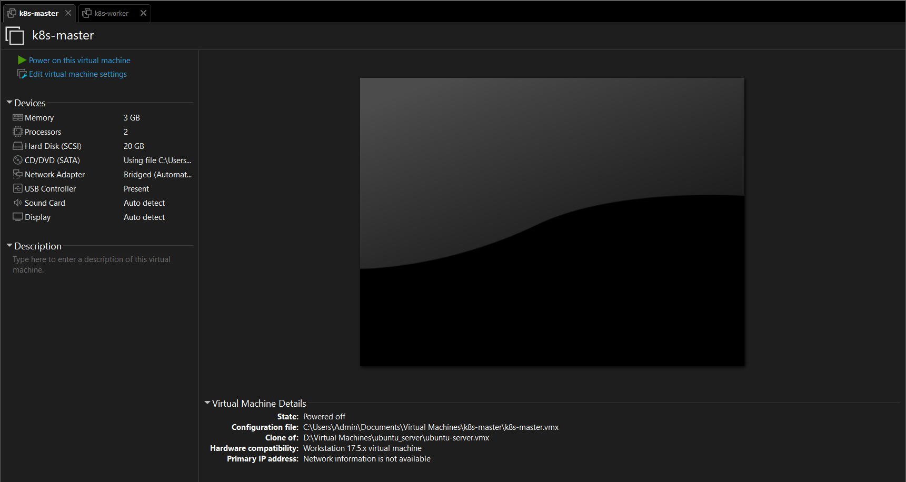
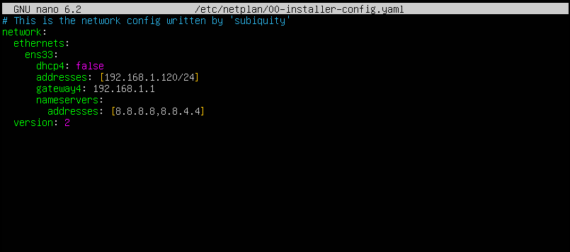
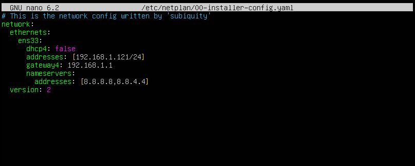
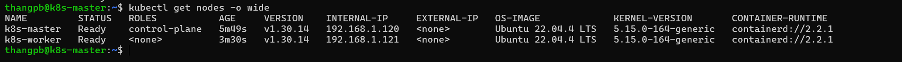
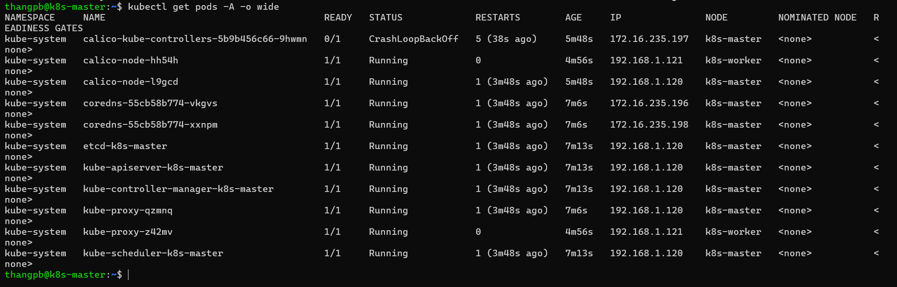
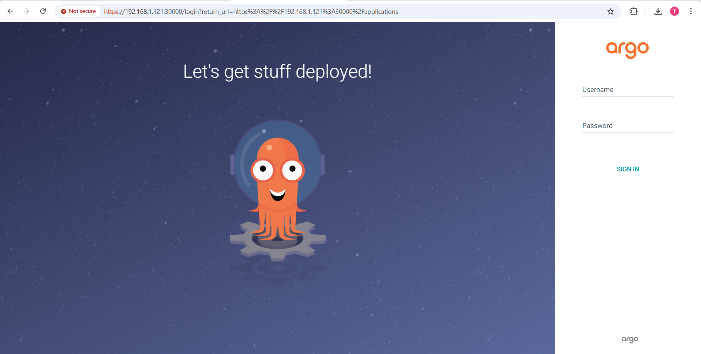
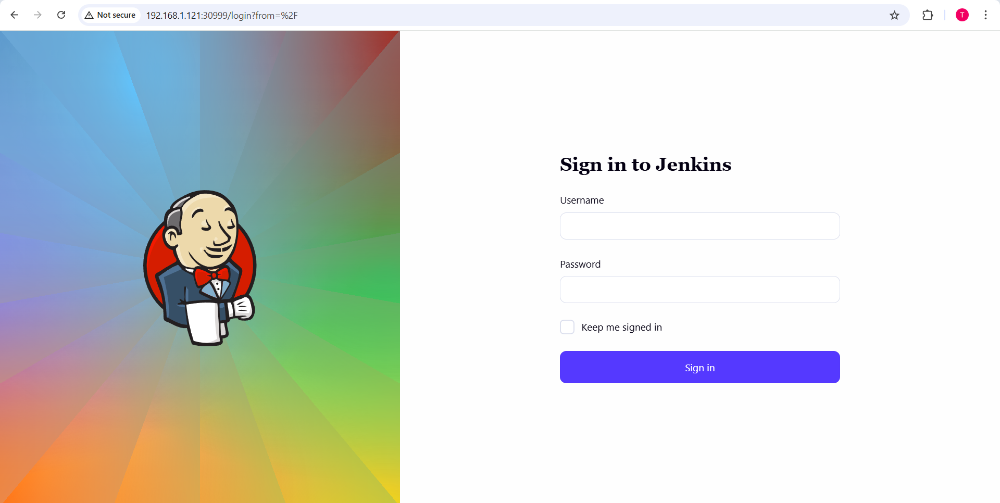

# Bài tập cuối khóa Cloud
---
## Phần 1: Triển khai cụm K8s
### Chuẩn bị
- Hai VM với cấu hình:
    - **CPU**: 2 core
    - **RAM**: 3GB
    - **Dung lượng bộ nhớ**: 20GB
- Hình ảnh minh họa:



### Cấu hình mạng cho VM
- Đại chỉ IP tĩnh cho 2 máy:
    - **Master**: 192.168.1.120
    - **Worker**: 192.168.1.121
- Master:



- Worker:



### Cài đặt K8s thông qua công cụ kubeadm
- Tắt swap: kubelet mặc định không chạy khi swap bật, vì ảnh hưởng quản lý bộ nhớ
    ```bash
    sudo swapoff -a
    sudo sed -i '/ swap / s/^/#/' /etc/fstab
    ```
- Bật kernel modules và sysctl cho networking
    - `br_netfilter`: để iptables nhìn thấy traffic qua bridge
    - `ip_forward`: cho phép routing gói tin giữa pod/subnet
    ```bash
    cat <<EOF | sudo tee /etc/modules-load.d/k8s.conf
    overlay
    br_netfilter
    EOF

    sudo modprobe overlay
    sudo modprobe br_netfilter

    cat <<EOF | sudo tee /etc/sysctl.d/k8s.conf
    net.bridge.bridge-nf-call-iptables  = 1
    net.bridge.bridge-nf-call-ip6tables = 1
    net.ipv4.ip_forward                 = 1
    EOF

    sudo sysctl --system
    ```
- Cài containerd: Kubernetes hiện khuyến nghị runtime dùng systemd cgroup để đồng bộ với kubelet
    ```bash
    sudo apt update
    sudo apt install -y containerd
    sudo mkdir -p /etc/containerd
    containerd config default | sudo tee /etc/containerd/config.toml >/dev/null
    ```
    ```bash
    sudo sed -i 's/SystemdCgroup = false/SystemdCgroup = true/' /etc/containerd/config.toml
    sudo systemctl restart containerd
    sudo systemctl enable containerd
    ```
- Cài kubeadm/kubelet/kubectl
    - `kubeadm`: công cụ bootstrap cluster (init/join)
    - `kubelet`: agent chạy trên node, quản lý pod/container
    - `kubectl`: CLI quản trị cluster
    ```bash
        sudo apt update
    sudo apt install -y apt-transport-https ca-certificates curl gpg
    curl -fsSL https://pkgs.k8s.io/core:/stable:/v1.30/deb/Release.key | sudo gpg --dearmor -o /etc/apt/keyrings/kubernetes-apt-keyring.gpg
    echo "deb [signed-by=/etc/apt/keyrings/kubernetes-apt-keyring.gpg] https://pkgs.k8s.io/core:/stable:/v1.30/deb/ /" | sudo tee /etc/apt/sources.list.d/kubernetes.list

    sudo apt update
    sudo apt install -y kubelet kubeadm kubectl
    sudo apt-mark hold kubelet kubeadm kubectl
    ```
### Dựng cụm với 1 master - 1 worker
- Khởi tạo control-plane (trên node master): `sudo kubeadm init`
- Cấu hình kubeconfig cho user (trên node master)
    ```bash
    mkdir -p $HOME/.kube
    sudo cp -i /etc/kubernetes/admin.conf $HOME/.kube/config
    sudo chown $(id -u):$(id -g) $HOME/.kube/config
    ```
- Cài netwwork với Calico: `kubectl apply -f https://raw.githubusercontent.com/projectcalico/calico/v3.25.0/manifests/calico.yaml`
- Thêm worker vào cluster (trên node worker)
    ```bash
    kubeadm join 192.168.1.120:6443 --token m9wqak.afb0zw2bfjqium8x \
        --discovery-token-ca-cert-hash sha256:927274508dd33bac2a7d82ec4feae8fa84798ed7477e68d22b462a6c4b0ea2c1
    ```
### Kiểm tra hệ thống
- `kubectl get nodes -o wide`



- `kubectl get pods -A -o wide`



---
## Phần 2: K8s-HelmChart
### App được lựa chọn
- hehe ...
### Yêu cầu 1
- **Mục tiêu**: cài đặt được Jenkins và ArgoCD, expose được qua NodePor
#### Cài đặt ArgoCD
- Install ArgoCD:
    ```bash
    kubectl create namespace argocd
    kubectl apply -n argocd -f https://raw.githubusercontent.com/argoproj/argo-cd/stable/manifests/install.yaml
    ```
- File Manifest triển khai dịch vụ ArgoCD qua NodePort
    ```yml
    apiVersion: v1
    kind: Service
    metadata:
      name: argocd-server-nodeport
      namespace: argocd
    spec:
      type: NodePort
      ports:
        - port: 80
          targetPort: 8080
          nodePort: 30000
      selector:
        app.kubernetes.io/name: argocd-server
    ```
- Truy cập ArgoCD:
    - NodeIP: 192.168.1.121
    - NodePort của AgroCD: 30000
- Giao diện ArgoCD



#### Cài đặt Jenkins
- Install Jenkins:
    ```bash
    kubectl create namespace jenkins
    nano jenkins.yaml
    kubectl apply -f jenkins.yaml
    ```
- File Manifest triển khai dịch vụ Jenkins: [File cài đăth jenkins](./manifest/jenkins.yaml)
- Truy cập jenkins:
    - NodeIP: 192.168.1.121
    - NodePort của AgroCD: 30999
- Giao diện jenkins



### Yêu cầu 2
- ...

---
## Phần 3: CI/CD

---
## Phần 4: Monitoring

---
## Phần 5: Logging

---
## Phần 6: Security