# Bài tập cuối khóa Cloud
---
## Phần 1: Triển khai cụm K8s
### Chuẩn bị
- Hai VM với cấu hình:
    - **CPU**: 2 core
    - **RAM**: 3GB
    - **Dung lượng bộ nhớ**: 50GB
- Hình ảnh minh họa:

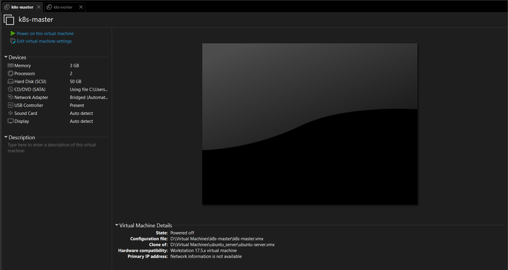

### Cấu hình mạng cho VM
- Địa chỉ IP tĩnh cho 2 máy:
    - **Master**: 192.168.1.120
    - **Worker**: 192.168.1.121
- Master:


- Worker:

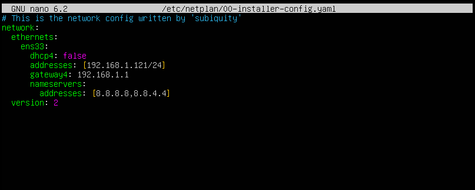

### Cài đặt Kubernetes
- Tắt swap: kubelet mặc định không chạy khi swap bật, vì ảnh hưởng quản lý bộ nhớ
    ```bash
    sudo swapoff -a
    sudo sed -i '/ swap / s/^/#/' /etc/fstab
    ```
- Bật kernel modules và sysctl cho networking
    - **br_netfilter**: để iptables nhìn thấy traffic qua bridge
    - **ip_forward**: cho phép routing gói tin giữa pod/subnet
    ```bash
    cat <<EOF | sudo tee /etc/modules-load.d/k8s.conf
    overlay
    br_netfilter
    EOF

    sudo modprobe overlay
    sudo modprobe br_netfilter

    cat <<EOF | sudo tee /etc/sysctl.d/k8s.conf
    net.bridge.bridge-nf-call-iptables  = 1
    net.bridge.bridge-nf-call-ip6tables = 1
    net.ipv4.ip_forward                 = 1
    EOF

    sudo sysctl --system
    ```
- Cài containerd: Kubernetes hiện khuyến nghị runtime dùng systemd cgroup để đồng bộ với kubelet
    ```bash
    sudo apt update
    sudo apt install -y containerd
    sudo mkdir -p /etc/containerd
    containerd config default | sudo tee /etc/containerd/config.toml >/dev/null
    ```
    ```bash
    sudo sed -i 's/SystemdCgroup = false/SystemdCgroup = true/' /etc/containerd/config.toml
    sudo systemctl restart containerd
    sudo systemctl enable containerd
    ```
- Cài kubeadm/kubelet/kubectl
    - **kubeadm**: công cụ bootstrap cluster (init/join)
    - **kubelet**: agent chạy trên node, quản lý pod/container
    - **kubectl**: CLI quản trị cluster
    ```bash
    sudo apt update
    sudo apt install -y apt-transport-https ca-certificates curl gpg
    curl -fsSL https://pkgs.k8s.io/core:/stable:/v1.30/deb/Release.key | sudo gpg --dearmor -o /etc/apt/keyrings/kubernetes-apt-keyring.gpg
    echo "deb [signed-by=/etc/apt/keyrings/kubernetes-apt-keyring.gpg] https://pkgs.k8s.io/core:/stable:/v1.30/deb/ /" | sudo tee /etc/apt/sources.list.d/kubernetes.list

    sudo apt update
    sudo apt install -y kubelet kubeadm kubectl
    sudo apt-mark hold kubelet kubeadm kubectl
    ```
### Dựng cụm với 1 master - 1 worker
- Khởi tạo control-plane (trên node master)
    ```bash
    sudo kubeadm init
    ```
- Cấu hình kubeconfig cho user (trên node master)
    ```bash
    mkdir -p $HOME/.kube
    sudo cp -i /etc/kubernetes/admin.conf $HOME/.kube/config
    sudo chown $(id -u):$(id -g) $HOME/.kube/config
    ```
- Cài netwwork với Calico 
    ```bash
    kubectl apply -f https://raw.githubusercontent.com/projectcalico/calico/v3.25.0/manifests/calico.yaml
    ```
- Thêm worker vào cluster (trên node worker)
    ```bash
    kubeadm join 192.168.1.120:6443 --token m9wqak.afb0zw2bfjqium8x \
        --discovery-token-ca-cert-hash sha256:927274508dd33bac2a7d82ec4feae8fa84798ed7477e68d22b462a6c4b0ea2c1
    ```
### Kiểm tra hệ thống
- `kubectl get nodes -o wide`

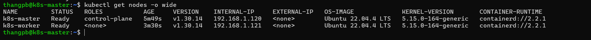

- `kubectl get pods -A -o wide`


---
## Phần 2: K8s-HelmChart
### App được lựa chọn
- Web quản lý sinh viên
- Teck stack:
    - **Frontend**: React Vite JS
    - **Backend**: Node JS
    - **Database**: MySQL
- Hình ảnh


### Yêu cầu 1
- **Mục tiêu**: cài đặt được Jenkins và ArgoCD, expose được qua NodePort
#### Cài đặt ArgoCD
- Install ArgoCD:
    ```bash
    kubectl create namespace argocd
    kubectl apply -n argocd -f https://raw.githubusercontent.com/argoproj/argo-cd/stable/manifests/install.yaml
    ```
- File Manifest triển khai dịch vụ ArgoCD qua NodePort
    ```yml
    apiVersion: v1
    kind: Service
    metadata:
      name: argocd-server-nodeport
      namespace: argocd
    spec:
      type: NodePort
      ports:
        - port: 80
          targetPort: 8080
          nodePort: 30000
      selector:
        app.kubernetes.io/name: argocd-server
    ```
- Truy cập ArgoCD:
    - NodeIP: 192.168.1.121
    - NodePort của AgroCD: 30000
- Giao diện ArgoCD

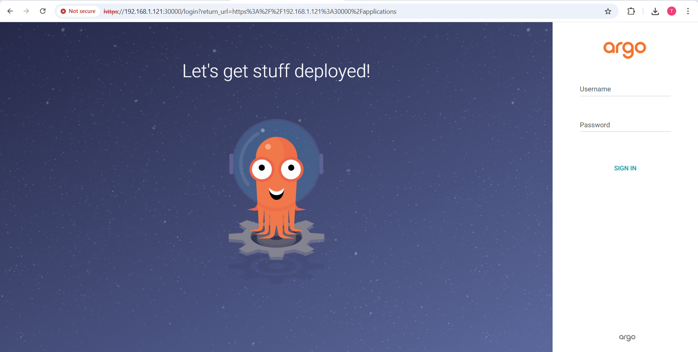

- Lệnh lấy pasword ArgoCD:
    ```bash
    kubectl -n argocd get secret argocd-initial-admin-secret \
        -o jsonpath="{.data.password}" | base64 -d; echo
    ```
#### Cài đặt Jenkins
- Install Jenkins:
    ```bash
    kubectl create namespace jenkins
    kubectl apply -f jenkins.yaml
    ```
- File Manifest triển khai Jenkins: [File manifest jenkins](./manifest/jenkins.yaml)
- Truy cập jenkins:
    - NodeIP: 192.168.1.121
    - NodePort của Jenkins: 30999
- Giao diện jenkins


### Yêu cầu 2
- **Tổng hợp các Repository**

| Repository | Mô tả | Link | 
|------------|-------|------|
| typ-backend | Source code backend | [Github](https://github.com/Phamthang-25/typ-backend) |
| typ-backend-config | Cấu hình backend | [Github](https://github.com/Phamthang-25/typ-backend-config) |
| typ-frontend | Source code frontend | [Github](https://github.com/Phamthang-25/typ-frontend) |
| typ-frontend-config | Cấu hình frontend | [Github](https://github.com/Phamthang-25/typ-frontend-config) |
| typ-db | Helm Chart cho DB | [Github](https://github.com/Phamthang-25/typ-db) |

- **Các Helm Chart để triển khai app**
1. Helm chart triển khai backend: [Source code](https://github.com/Phamthang-25/typ-backend/tree/main/backend-chart)
2. Helm chart triển khai frontend: [Source code](https://github.com/Phamthang-25/typ-frontend/tree/main/frontend-chart)
3. Helm chart triển khai database: [Source code](https://github.com/Phamthang-25/typ-db/tree/main/db-chart)

- **`values-prod.yaml` của backend-config**
    ```yml
    image:
      repository: thang05/typ-backend
      tag: "v1.0.1"
      pullPolicy: IfNotPresent

    service:
      name: student-backend
      port: 3000

    env:
      PORT: "3000"

      DB_HOST: "student-mysql"
      DB_PORT: "3306"
      DB_NAME: "studentdb"
      DB_USER: "appuser"
      DB_PASSWORD: "apppass"
    ```
- **`values-prod.yaml` của frontend-config**
    ```yml
    image:
      repository: thang05/typ-frontend
      tag: "v1.0.1"
      pullPolicy: IfNotPresent

    service:
      name: student-frontend
      port: 80

    ingress:
      enabled: true
      className: nginx
      host: student.example.com
      path: /
    ```
#### Manifest ArgoCD Application
1. **Manifest triển khai backend**
```yml
apiVersion: argoproj.io/v1alpha1
kind: Application
metadata:
  name: typ-backend-prod
  namespace: argocd
spec:
  project: default
  destination:
    server: https://kubernetes.default.svc
    namespace: student-prod
  syncPolicy:
    automated:
      prune: true
      selfHeal: true
    syncOptions:
      - CreateNamespace=true

  sources:
    - repoURL: https://github.com/Phamthang-25/typ-backend.git
      targetRevision: main
      path: backend-chart
      helm:
        valueFiles:
          - $values/helm-values/values-prod.yaml

    - repoURL: https://github.com/Phamthang-25/typ-backend-config.git
      targetRevision: main
      ref: values
```
2. **Manifest triển khai frontend**
```yml
apiVersion: argoproj.io/v1alpha1
kind: Application
metadata:
  name: typ-frontend-prod
  namespace: argocd
spec:
  project: default
  destination:
    server: https://kubernetes.default.svc
    namespace: student-prod
  syncPolicy:
    automated:
      prune: true
      selfHeal: true
    syncOptions:
      - CreateNamespace=true

  sources:
    - repoURL: https://github.com/Phamthang-25/typ-frontend.git
      targetRevision: main
      path: frontend-chart
      helm:
        valueFiles:
          - $values/helm-values/values-prod.yaml

    - repoURL: https://github.com/Phamthang-25/typ-frontend-config.git
      targetRevision: main
      ref: values
```
3. **Manifest triển khai database**
```yml
apiVersion: argoproj.io/v1alpha1
kind: Application
metadata:
  name: typ-db-prod
  namespace: argocd
spec:
  project: default
  destination:
    server: https://kubernetes.default.svc
    namespace: student-prod
  syncPolicy:
    automated:
      prune: true
      selfHeal: true
    syncOptions:
      - CreateNamespace=true
  source:
    repoURL: https://github.com/Phamthang-25/typ-db.git
    targetRevision: main
    path: db-chart
    helm:
      valueFiles:
        - values.yaml
```
- **Ảnh chụp màn hình ArgoCD**
- Tổng quan các Application

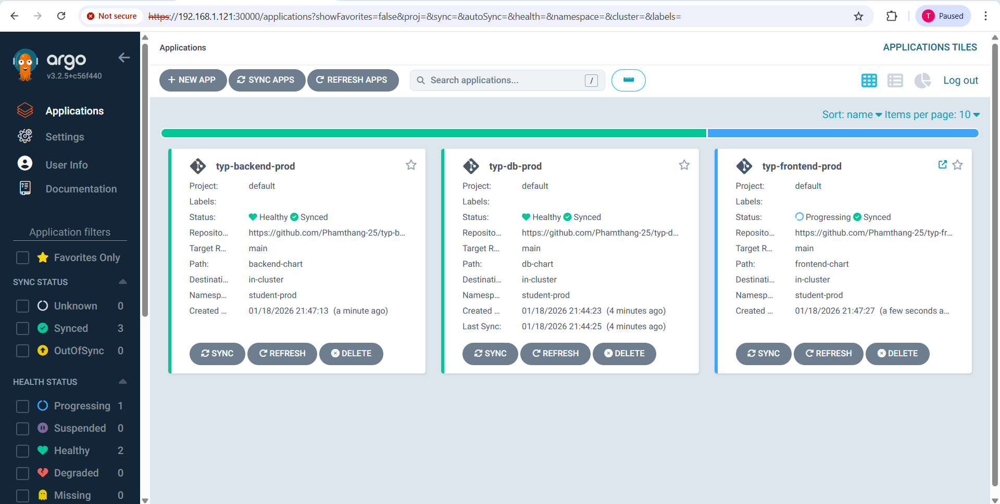

- Backend application

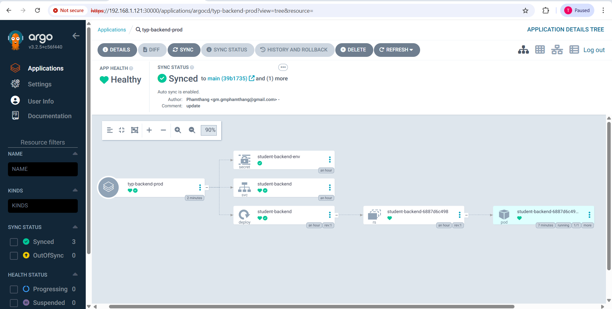


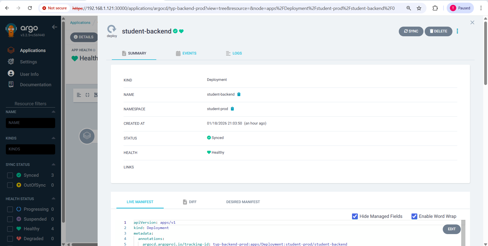

- frontend application

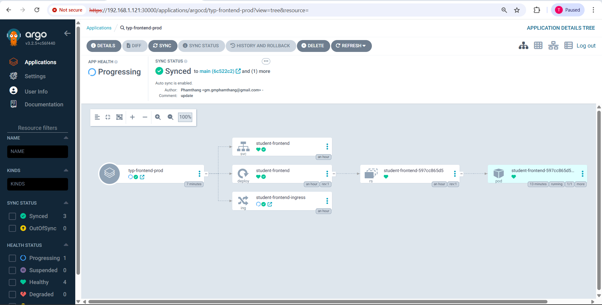

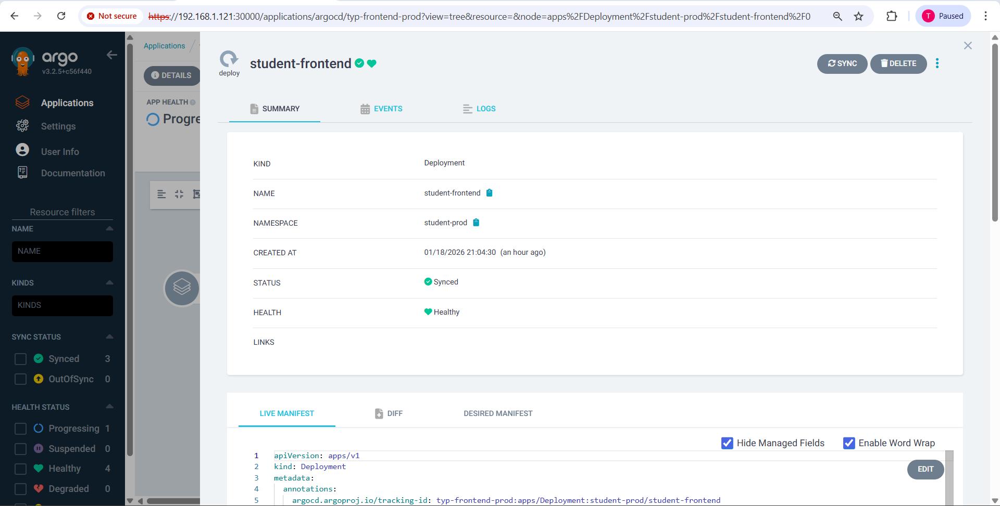

- Database application

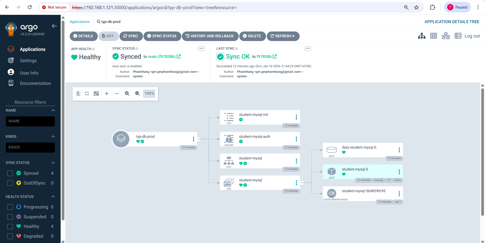

- **Ảnh màn hình trình duyệt**: đến đây e có tạo thêm các NodePort


- Hình ảnh truy cập frontend


- Truy cập vào API

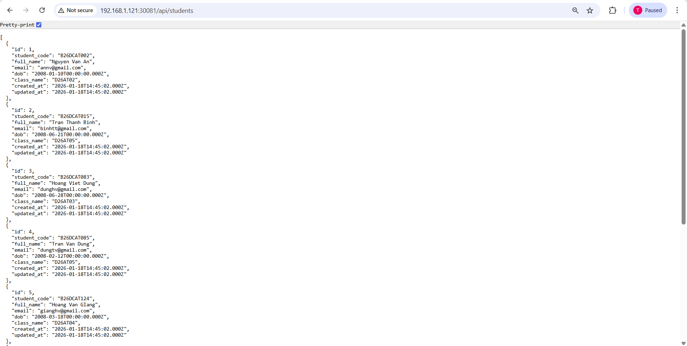

---
## Phần 3: CI/CD

---
## Phần 4: Monitoring

---
## Phần 5: Logging

---
## Phần 6: Security